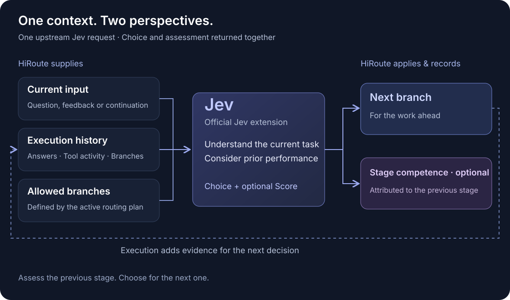

<p align="right"><a href="README.zh-CN.md">简体中文</a></p>

<p align="center">
  <a href="https://hiroute.ai/">
    
  </a>
</p>

<p align="center">
  <strong>Route agents by task. Route models by stage.</strong><br>
  A local-first routing and coordination engine for long-running agent work.
</p>

<p align="center">
  <a href="https://hiroute.ai/">Website</a> ·
  <a href="https://hiroute.ai/download/">Download</a> ·
  <a href="https://hiroute.ai/en/docs/">Documentation</a> ·
  <a href="https://hiroute.ai/en/docs/decision-api/">Decision API</a> ·
  <a href="CONTRIBUTING.md">Contributing</a>
</p>

<p align="center">
  <a href="https://github.com/higress-group/HiRoute/releases/latest"></a>
  <a href="LICENSE"></a>
  <a href="https://hiroute.ai/download/"></a>
</p>

HiRoute is a local control and execution layer for long-horizon agents. It brings model
sources, reusable routing plans, agent connections, bounded failover, and execution evidence
into one system, available through a Desktop application or a headless CLI and daemon.

It is not a proxy that swaps models on every tool call. HiRoute keeps a selected branch stable
through an execution stage, then chooses again at a natural boundary—such as new user input or
the context rebuild that follows compaction. This preserves reusable prefixes within a stage
and makes model switching friendly to provider KV caches.

## Why HiRoute

| | |
| --- | --- |
| **Route long tasks by stage** | Use the model that fits the work ahead instead of committing an entire task to one model. |
| **Protect quality while saving** | Use observed competence to block risky downgrades, while task complexity creates opportunities to use economical models. |
| **Keep handoffs bounded** | Enforce capability requirements, ordered candidates, and explicit exhaustion instead of silently changing behavior. |
| **Learn from execution** | Retain the selected branch, actual model, tool outcomes, accepted output, and optional stage competence for later decisions. |

HiRoute currently provides fixed-model, smart-saving, free-first, and ordered-fallback routing;
agent work plans and Worker delegation; local session, usage, cost, and competence views; and a
public Decision API for custom selection strategies.

## Get started

### macOS Desktop

Download the current DMG from [hiroute.ai](https://hiroute.ai/download/), drag HiRoute into
Applications, and follow the [self-signed package instructions](docs/macos-installation.md) if
macOS asks for manual approval. The download page is the authority for validated operating
systems and architectures.

### Linux headless

Install the current-user CLI and daemon without `sudo`:

```sh
curl -fsSL https://hiroute.ai/install.sh | sh
hiroute service start --output json
hiroute system status --output json
```

The installer verifies the published package manifest and checksums and does not start a
service automatically. See the [Linux installation guide](https://hiroute.ai/en/docs/install-linux/)
and [CLI reference](docs/standalone-cli.md) for service lifecycle and machine-readable commands.

### Configure your first route

1. Connect a supported subscription, registered API, or compatible custom API.
2. Create and publish a routing plan for the task and cost profile you want.
3. Connect an Agent client, or expose a Worker plan for delegated tasks.
4. Inspect sessions and runtime performance to understand the selected branch and actual model.

Continue with [model routing](https://hiroute.ai/en/docs/model-routing/),
[task routing](https://hiroute.ai/en/docs/task-routing/), or the
[headless CLI guide](https://hiroute.ai/en/docs/cli/).

## See routing performance

<p align="center">
  
</p>

The performance view follows the models selected by the active routing-plan revision; users do
not need to enter internal model IDs. The screenshot uses realistic synthetic data rendered by
real product components. It demonstrates the UI states and is not a model benchmark.

## How routing works



A routing execution round begins with one branch decision. Ordinary tool continuations keep
that decision while the current context remains reusable. HiRoute decides again when a new user
request changes the work, or when a long session compacts and rebuilds its context. The routing
engine determines whether a decision can be inherited; clients do not need to emit a separate
compaction event. A provider or model failure can still use the plan's bounded fallback inside
the round; fallback is distinct from a new classification decision.

At a decision boundary, a service may do two related jobs in one response:

- choose one of the branch IDs allowed by HiRoute for the next round;
- optionally assess how competently the previous model handled its execution stage.

The official [TypeSafe Jev extension](decision-extensions/extensions/jev-decider/README.md)
implements this contract with one OpenRouter request. Its Rules policy uses task complexity
and the optional assessment together: choose economy only when the simple-task probability
meets the threshold and no valid current score falls below the competence floor. Otherwise,
choose primary. A missing score leaves the decision to complexity alone.

The principle is:

> **Competence blocks risky cost-cutting; complexity creates opportunities to save.**

Jev is optional. You can use built-in rules or implement the same general multi-branch contract
with an LLM or your own policy. Start with the [decision mechanism](decision-extensions/README.md),
the [API guide](decision-extensions/api/README.md), or the canonical
[OpenAPI document](decision-extensions/api/decision.openapi.json).

## For technical contributors

HiRoute is a Rust workspace with a Tauri Desktop client and an Astro website. The Rust toolchain
is pinned in `rust-toolchain.toml`; Desktop uses Node.js 24 and the website uses Node.js 22.

```sh
git clone https://github.com/higress-group/HiRoute.git
cd HiRoute

cargo fmt --check
cargo test --locked --workspace --exclude hiroute-desktop --all-features
```

For frontend work, run the checks in the affected application:

```sh
cd apps/desktop   # or apps/website
npm ci --ignore-scripts
npm test
npm run build
```

See [CONTRIBUTING.md](CONTRIBUTING.md) for native dependencies, Clippy, validation scope, and
language conventions. Native Desktop behavior and real-provider integration require their
respective environments; a source build alone is not product acceptance.

### Repository map

| Path | Responsibility |
| --- | --- |
| `apps/desktop` | Desktop UI and Tauri host |
| `crates/cli`, `crates/daemon` | Headless client and local role-all service |
| `crates/application`, `crates/client-core` | Application workflows and shared client behavior |
| `crates/gateway`, `crates/gateway-core` | Agent-facing protocols, routing, execution, and fallback |
| `crates/observation`, `crates/local-storage` | Local execution evidence, queries, and persistence |
| `decision-extensions` | Decision mechanism, OpenAPI contract, screenshots, and official Jev service |
| `contracts`, `assets` | Current runtime contracts, model metadata, and product resources |
| `apps/website` | Bilingual `hiroute.ai` site, downloads, and release publication |
| `e2e`, `tools`, `scripts` | Product scenarios, validation tools, packaging, and automation |

## Project status

HiRoute is an MVP. Platform and architecture claims are tied to the evidence for each release;
source availability does not imply that every environment has been validated. Current Agent
integrations and planned directions remain separate on the [website](https://hiroute.ai/).

HiRoute is licensed under the [Apache License 2.0](LICENSE). Use
[GitHub Issues](https://github.com/higress-group/HiRoute/issues) for bugs and feature requests.
Report security issues and crash reports through the process in [SECURITY.md](SECURITY.md).
