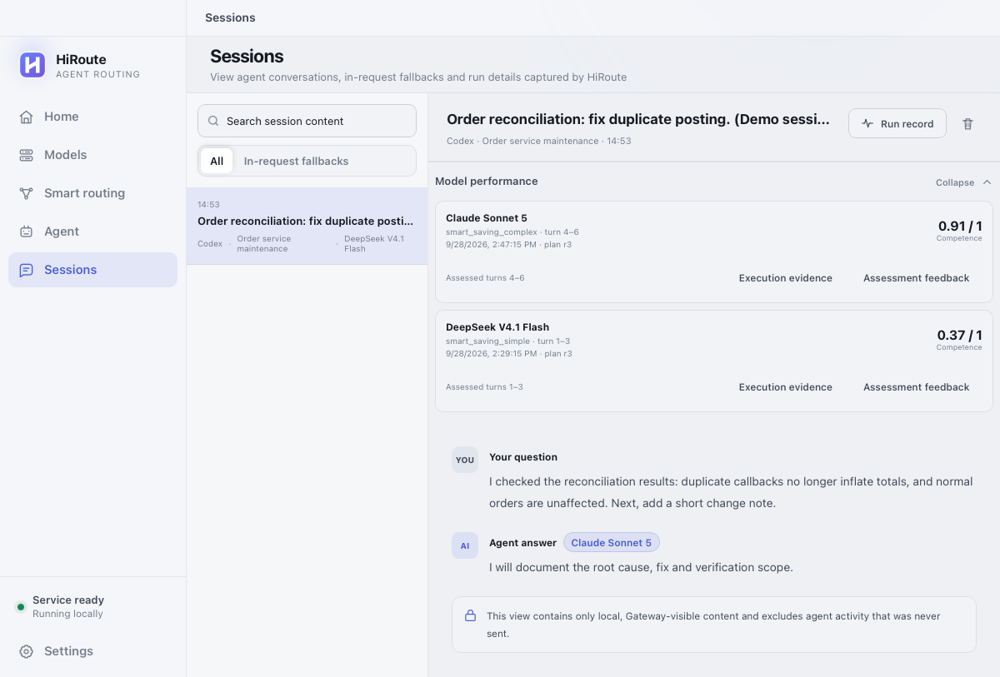
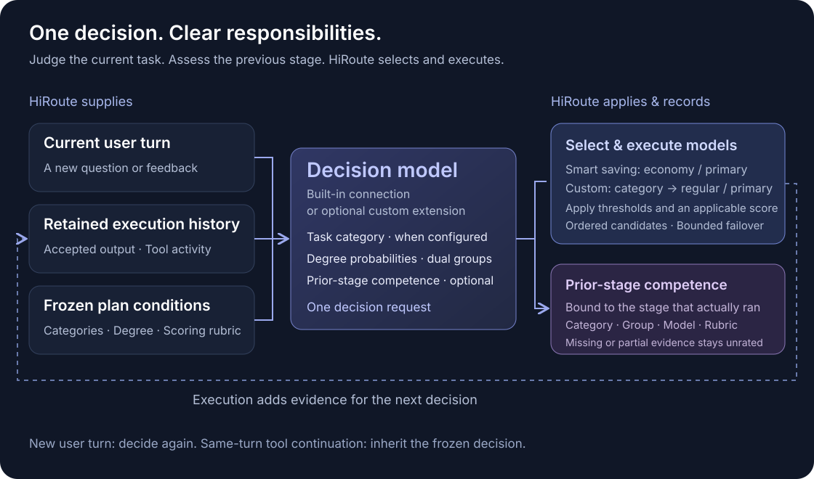

<p align="right"><a href="README.zh-CN.md">简体中文</a></p>

<p align="center">
  <a href="https://hiroute.ai/">
    
  </a>
</p>

<p align="center">
  <strong>Route agents by task. Route models by stage.</strong><br>
  A local-first routing and coordination engine for long-horizon agent tasks.
</p>

<p align="center">
  <a href="https://hiroute.ai/">Website</a> ·
  <a href="https://hiroute.ai/download/">Download</a> ·
  <a href="https://hiroute.ai/en/docs/">Documentation</a> ·
  <a href="https://hiroute.ai/en/docs/decision-extensions/">Decision models</a> ·
  <a href="CONTRIBUTING.md">Contributing</a>
</p>

<p align="center">
  <a href="https://github.com/higress-group/HiRoute/releases/latest"></a>
  <a href="LICENSE"></a>
  <a href="https://hiroute.ai/download/"></a>
</p>

HiRoute is a local control and execution layer for long-horizon agents. It brings model
sources, reusable routing plans, agent connections, bounded failover, and execution evidence
into one system, available through a Desktop application or a headless CLI and daemon.

Decision-based routes choose again on each new user turn. Tool continuations in the same turn
keep the frozen decision, helping the model reuse its growing context prefix. A context rebuild
can require a new decision when HiRoute can no longer recognize the continuation or reuse its
previous decision. Choosing again can also keep the same model; cache reuse depends on the provider.

## News

- **2026-10-08 · HiRoute 0.2.0** — Stable release with built-in decision models, expanded Agent integrations, and macOS/Linux packages for x86_64 and ARM64. [Release notes](https://github.com/higress-group/HiRoute/releases/tag/v0.2.0) · [Download](https://hiroute.ai/en/download/)
- **2026-10-04** — [GPT-6 Astra × Qwen-3.8 Flash: same quality at 90% lower cost](news/2026-10-04-astra-qwen.en.md). [Website article](https://hiroute.ai/en/news/astra-qwen-smart-routing/) · [Experiments](experiments/README.md)
- [All news](news/README.md)

## Why HiRoute

| | |
| --- | --- |
| **Route long tasks by stage** | Use the model that fits the work ahead instead of committing an entire task to one model. |
| **Protect quality while saving** | Use observed competence to block risky downgrades, while task complexity creates opportunities to use economical models. |
| **Keep handoffs bounded** | Enforce capability requirements, ordered candidates, and explicit exhaustion instead of silently changing behavior. |
| **Learn from execution** | Retain the task category, actual model group and candidate, tool outcomes, accepted output, and optional stage competence for later decisions. |

HiRoute currently provides four routing modes: fixed model, smart saving, custom branches, and free first.
Each mode uses the plan's ordered candidates for bounded failover. It also provides agent work plans
and Worker delegation; local session, usage, cost, and competence views; and a custom extension API
for connecting your own decision service.

## Get started

### macOS Desktop

Download the current DMG from [hiroute.ai](https://hiroute.ai/download/), drag HiRoute into
Applications, and follow the [self-signed package instructions](docs/macos-installation.md) if
macOS asks for manual approval. HiRoute 0.2.0 supports macOS 15 or later on Apple silicon
(`arm64`) and Intel (`x86_64`).

### Linux headless

Install the current-user CLI and daemon on Linux `x86_64` or ARM64 (`aarch64`) without `sudo`:

```sh
curl -fsSL https://hiroute.ai/install.sh | sh
hiroute service start --output json
hiroute system status --output json
```

The installer verifies the published package manifest and checksums and does not start a
service automatically. See the [Linux installation guide](https://hiroute.ai/en/docs/install-linux/)
and [CLI reference](docs/standalone-cli.md) for service lifecycle and machine-readable commands.

### Configure your first route

1. Connect a supported subscription, registered API, or compatible custom API.
2. For model-based judgment, open **Models → Decision models** and connect Bailian,
   OpenRouter Jev, TypeSafe, or a compatible endpoint. Built-in connections need no self-hosted
   Jev service.
3. Create and publish a routing plan, using smart saving or custom task branches when needed.
4. Connect an Agent client, or expose a Worker plan for delegated tasks.
5. Inspect sessions and model performance to understand the task category, actual model group,
   and execution result.

Continue with [model routing](https://hiroute.ai/en/docs/model-routing/),
[task routing](https://hiroute.ai/en/docs/task-routing/), or the
[headless CLI guide](https://hiroute.ai/en/docs/cli/).

## See routing performance

<p align="center">
  
</p>

Review model performance within a task, alongside execution records and user feedback, to inform
the next model choice and task delegation. Each score stays linked to its execution stage.

## How routing works



Built-in decision models judge the task category when needed and return simple/complex
probabilities for routes with two model groups. They can also assess the previous execution stage.
HiRoute supplies the published conditions and scoring criteria, applies your thresholds,
and chooses the model group and ordered candidates.
Configure these connections in **Models → Decision models**; you do not need to deploy an extension.

**Smart saving** has one task scope with economy and primary model groups. Economy is selected
when this turn's simple-task probability meets your threshold and no applicable, complete
assessment falls below the competence floor. Otherwise HiRoute selects primary. Missing or
partial scores stay unrated. An old low score does not lock future turns to primary, and a new
turn does not automatically return to economy: HiRoute judges the current work again.

**Custom branches** separate task categories such as drafting and review. HiRoute first uses
the category choice, then the simple/complex degree within that category to choose its regular
or optional primary group. A category with only a regular group needs no degree judgment.
An assessment belongs to the stage that actually ran; a low drafting score does not upgrade
the review category. Only a complete, applicable assessment for the same category, published
revision, and frozen criteria can affect this turn's group choice.

Tool continuations keep the decision when HiRoute can recognize the same turn and reuse its
frozen decision. Candidate failures use bounded failover: regular candidates may relay to the
same category's primary group, while a primary selection stays within primary. Exhaustion fails
explicitly. Failover does not create a competence score or change the task category.

The principle is:

> **Competence blocks risky cost-cutting; complexity creates opportunities to save.**

Smart saving also supports heuristic rules. A custom extension is optional: use it when you
want to own the model integration, judgment, scoring, and context trimming. The official
[Jev extension](decision-extensions/extensions/jev-decider/README.md) is one implementation
of that boundary. Start with [decision models and the routing mechanism](decision-extensions/README.md),
the [custom extension API guide](decision-extensions/api/README.md), or the canonical
[OpenAPI document](decision-extensions/api/decision.openapi.json).

## For technical contributors

HiRoute is a Rust workspace with a Tauri Desktop client and an Astro website. The Rust toolchain
is pinned in `rust-toolchain.toml`; Desktop uses Node.js 24 and the website uses Node.js 22.

```sh
git clone https://github.com/higress-group/HiRoute.git
cd HiRoute

cargo fmt --check
cargo test --locked --workspace --exclude hiroute-desktop --all-features
```

For frontend work, run the checks in the affected application:

```sh
cd apps/desktop   # or apps/website
npm ci --ignore-scripts
npm test
npm run build
```

See [CONTRIBUTING.md](CONTRIBUTING.md) for native dependencies, Clippy, validation scope, and
language conventions. Native Desktop behavior and real-provider integration require their
respective environments; a source build alone is not product acceptance.

### Repository map

The [code map](docs/code-map/README.md) connects user capabilities to architecture,
production owners and representative tests.

| Path | Responsibility |
| --- | --- |
| `apps/desktop` | Desktop UI and Tauri host |
| `crates/cli`, `crates/daemon` | Headless client and local role-all service |
| `crates/application`, `crates/client-core` | Application workflows and shared client behavior |
| `crates/gateway`, `crates/gateway-core` | Agent-facing protocols, routing, execution, and fallback |
| `crates/observation`, `crates/local-storage` | Local execution evidence, queries, and persistence |
| `decision-extensions` | Decision model guides, routing mechanism, extension API, screenshots, and optional Jev extension |
| `contracts`, `assets` | Current runtime contracts, model metadata, and product resources |
| `apps/website` | Bilingual `hiroute.ai` site, downloads, and release publication |
| `e2e`, `tools`, `scripts` | Product scenarios, validation tools, packaging, and automation |

## Project status

HiRoute 0.2.0 is a stable release with macOS Desktop and Linux headless packages for both
x86_64 and ARM64. Download the latest version and read the release notes on the
[website](https://hiroute.ai/en/download/).

HiRoute is licensed under the [Apache License 2.0](LICENSE). Use
[GitHub Issues](https://github.com/higress-group/HiRoute/issues) for bugs and feature requests.
Report security issues and crash reports through the process in [SECURITY.md](SECURITY.md).

Links: [LINUX DO](https://linux.do/) — a Chinese-language tech community.
