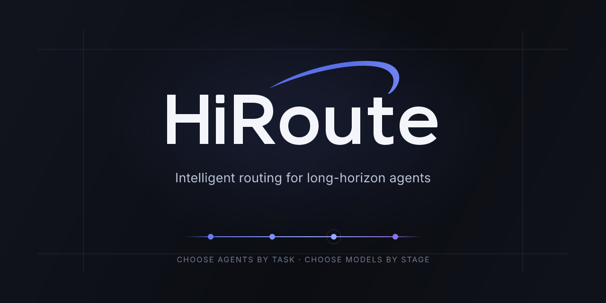
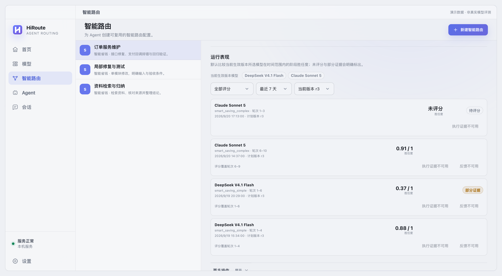
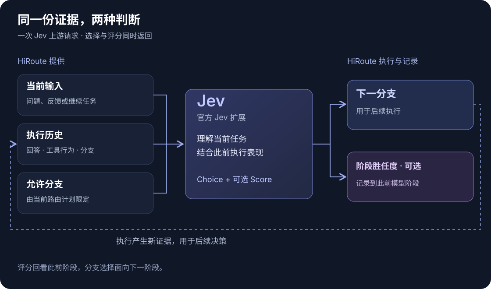

<p align="right"><a href="README.md">English</a></p>

<p align="center">
  <a href="https://hiroute.ai/">
    
  </a>
</p>

<p align="center">
  <strong>按任务选择 Agent，按阶段选择模型。</strong><br>
  面向长程 Agent 工作、本地优先的智能路由与协作引擎。
</p>

<p align="center">
  <a href="https://hiroute.ai/">官网</a> ·
  <a href="https://hiroute.ai/download/">下载</a> ·
  <a href="https://hiroute.ai/docs/">使用文档</a> ·
  <a href="https://hiroute.ai/docs/decision-api/">决策 API</a> ·
  <a href="CONTRIBUTING.md">参与贡献</a>
</p>

<p align="center">
  <a href="https://github.com/higress-group/HiRoute/releases/latest"></a>
  <a href="LICENSE"></a>
  <a href="https://hiroute.ai/download/"></a>
</p>

HiRoute 是长程 Agent 的本地控制与执行层。它把模型来源、可复用路由计划、Agent 接入、有边界的
故障接力和执行证据放在同一套系统里，同时提供 Desktop 应用以及无界面 CLI 和后台服务。

HiRoute 不是在每次工具调用时随意换模型的代理。一次执行阶段内会保持已选分支稳定，仅在新的用户
输入或上下文压缩后的自然重建时机重新选择。这样既能按阶段使用合适的模型，也能让阶段内前缀持续
复用，对模型供应商的 KV cache 友好。

## 为什么使用 HiRoute

| | |
| --- | --- |
| **按阶段路由长任务** | 不必让一个模型包办整段任务，而是根据后续工作选择合适的模型。 |
| **在降本时守住质量** | 胜任度用于阻止冒险降本，任务复杂度用于寻找采用经济模型的机会。 |
| **让接力有明确边界** | 校验能力要求、按顺序尝试候选，候选耗尽时明确停止，不静默改变行为。 |
| **让执行成为下一次决策的证据** | 保留选择分支、实际模型、工具结果、接受的输出和可选阶段胜任度。 |

HiRoute 当前提供固定模型、智能省钱、免费优先和有序故障接力路由；Agent 工作计划与 Worker
委派；本地会话、用量、成本和胜任度查看；以及用于扩展选择策略的公开决策 API。

## 快速开始

### macOS Desktop

从 [hiroute.ai](https://hiroute.ai/download/) 下载当前 DMG，拖入“应用程序”目录。如果 macOS
要求手动批准，请按[自签名安装说明](docs/macos-installation.zh-CN.md)操作。每个版本已验证的系统和
架构以下载页为准。

### Linux 无界面版

无需 `sudo`，安装到当前用户目录：

```sh
curl -fsSL https://hiroute.ai/install.sh | sh
hiroute service start --output json
hiroute system status --output json
```

安装器会校验已发布的 package manifest 与文件摘要，并且不会自动启动服务。服务生命周期和
机器可读命令见 [Linux 安装指南](https://hiroute.ai/docs/install-linux/)与
[CLI 参考](docs/standalone-cli.zh-CN.md)。

### 配置第一条路由

1. 接入受支持的本机订阅、注册 API 或兼容的自定义 API。
2. 根据任务与成本目标创建并发布路由计划。
3. 接入 Agent 客户端，或开放 Worker 计划供主 Agent 委派任务。
4. 在会话和运行表现中查看选择分支、实际模型和执行结果。

继续阅读[智能模型路由](https://hiroute.ai/docs/model-routing/)、
[智能任务路由](https://hiroute.ai/docs/task-routing/)或
[无界面 CLI 指南](https://hiroute.ai/docs/cli/)。

## 查看真实产品中的运行表现

<p align="center">
  
</p>

运行表现会自动展示当前路由计划生效版本中的模型，用户无需填写内部模型 ID。截图由真实产品组件
配合贴近实际的模拟数据生成，用于说明界面状态，不代表模型能力评测。

## 路由机制



一个路由执行轮次从一次分支选择开始。当前上下文可以持续复用时，普通工具续轮会保持该选择；新的
用户请求改变工作目标，或长会话发生压缩并重建上下文时，HiRoute 会再次决策。是否能继承已有决策
由路由引擎判断，客户端无需额外上报压缩事件。供应商或模型失败仍可在本轮内按计划执行有边界的
故障接力，它与重新分类是两件事。

在一个决策边界，同一次服务响应可以完成两个相关工作：

- 从 HiRoute 允许的 branch ID 中选择下一轮执行分支；
- 可选地评价上一模型在执行阶段中的胜任程度。

官方 [TypeSafe Jev 扩展](decision-extensions/extensions/jev-decider/README.zh-CN.md)通过一次
OpenRouter 请求实现这套协议。其 Rules 策略结合任务复杂度与可选胜任度：任务简单的概率达到门槛，
且本次合法评分未低于胜任度下限时，选择经济分支；否则选择主力分支。缺少评分时，仅依据复杂度判断。

这套机制的原则是：

> **胜任度只负责阻止冒险降本，复杂度负责提供降本机会。**

Jev 是可选扩展。你也可以使用内置规则，或通过 LLM、自有模型和规则实现同一套通用多分支协议。
可从[决策机制](decision-extensions/README.zh-CN.md)、
[API 说明](decision-extensions/api/README.zh-CN.md)或规范化
[OpenAPI 文档](decision-extensions/api/decision.openapi.json)开始。

## 面向技术开发者

HiRoute 是 Rust workspace，Desktop 使用 Tauri，官网使用 Astro。Rust 工具链由
`rust-toolchain.toml` 固定；Desktop 使用 Node.js 24，官网使用 Node.js 22。

```sh
git clone https://github.com/higress-group/HiRoute.git
cd HiRoute

cargo fmt --check
cargo test --locked --workspace --exclude hiroute-desktop --all-features
```

前端改动请在受影响的应用目录运行对应检查：

```sh
cd apps/desktop   # 或 apps/website
npm ci --ignore-scripts
npm test
npm run build
```

原生依赖、Clippy、验证范围和语言约定见[贡献指南](CONTRIBUTING.md)。macOS 原生 Desktop 行为和
真实供应商集成需要相应环境，源码构建成功本身不等于产品验收通过。

### 代码结构

| 目录 | 职责 |
| --- | --- |
| `apps/desktop` | Desktop 界面与 Tauri 宿主 |
| `crates/cli`、`crates/daemon` | 无界面客户端与本地 role-all 服务 |
| `crates/application`、`crates/client-core` | 应用工作流和共享客户端行为 |
| `crates/gateway`、`crates/gateway-core` | Agent 协议入口、路由、执行与故障接力 |
| `crates/observation`、`crates/local-storage` | 本地执行证据、查询与持久化 |
| `decision-extensions` | 决策机制、OpenAPI、产品截图和官方 Jev 服务 |
| `contracts`、`assets` | 当前运行合同、模型元数据和产品资源 |
| `apps/website` | `hiroute.ai` 双语官网、下载和版本发布 |
| `e2e`、`tools`、`scripts` | 产品场景、验证工具、打包和自动化 |

## 项目状态

HiRoute 当前处于 MVP 阶段。平台和架构声明与每个版本的验证证据绑定；源码存在不代表所有环境均已
验收。当前可用的 Agent 集成与后续方向会在[官网](https://hiroute.ai/)中明确区分。

HiRoute 使用 [Apache License 2.0](LICENSE)。缺陷和功能建议请提交到
[GitHub Issues](https://github.com/higress-group/HiRoute/issues)。安全问题和 crash report 请按
[SECURITY.md](SECURITY.md)中的流程提交。
