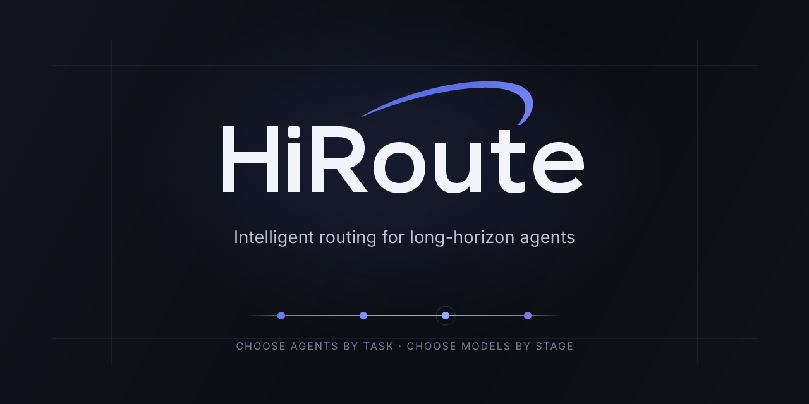
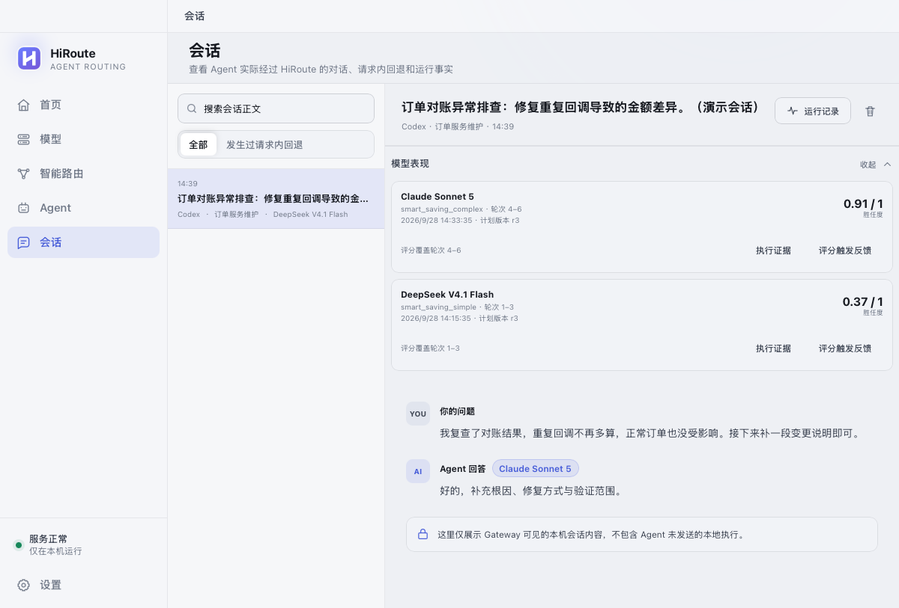
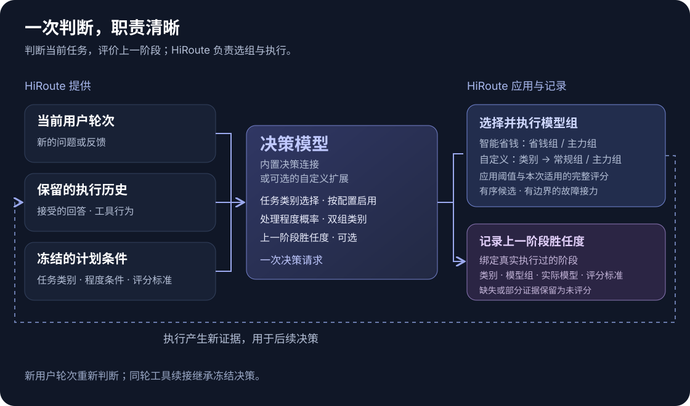

<p align="right"><a href="README.md">English</a></p>

<p align="center">
  <a href="https://hiroute.ai/">
    
  </a>
</p>

<p align="center">
  <strong>按任务选择 Agent，按阶段选择模型。</strong><br>
  面向长程 Agent 工作、本地优先的智能路由与协作引擎。
</p>

<p align="center">
  <a href="https://hiroute.ai/">官网</a> ·
  <a href="https://hiroute.ai/download/">下载</a> ·
  <a href="https://hiroute.ai/docs/">使用文档</a> ·
  <a href="https://hiroute.ai/docs/decision-extensions/">决策模型</a> ·
  <a href="CONTRIBUTING.md">参与贡献</a>
</p>

<p align="center">
  <a href="https://github.com/higress-group/HiRoute/releases/latest"></a>
  <a href="LICENSE"></a>
  <a href="https://hiroute.ai/download/"></a>
</p>

HiRoute 是长程 Agent 的本地控制与执行层。它把模型来源、可复用路由计划、Agent 接入、有边界的
故障接力和执行证据放在同一套系统里，同时提供 Desktop 应用以及无界面 CLI 和后台服务。

使用决策的路由会在每个新用户轮次重新判断，同轮工具续接保持冻结决策，让模型持续复用增长中的
上下文前缀。上下文重建后，如果 HiRoute 无法识别原来的续接关系或复用此前决策，才需要再次判断。
重新判断也可以继续原模型；缓存实际能否复用取决于供应商。

## News · 最新动态

- **2026-10-04** — [HiRoute 智能路由实战：GPT-6 Astra × Qwen-3.8 Flash，同等质量下成本降低 90%](news/2026-10-04-astra-qwen.zh-CN.md)。[官网阅读](https://hiroute.ai/news/astra-qwen-smart-routing/) · [复现实验](experiments/README.md)
- [全部新闻](news/README.md)

## 为什么使用 HiRoute

| | |
| --- | --- |
| **按阶段路由长任务** | 不必让一个模型包办整段任务，而是根据后续工作选择合适的模型。 |
| **在降本时守住质量** | 胜任度用于阻止冒险降本，任务复杂度用于寻找采用经济模型的机会。 |
| **让接力有明确边界** | 校验能力要求、按顺序尝试候选，候选耗尽时明确停止，不静默改变行为。 |
| **让执行成为下一次决策的证据** | 保留任务类别、实际模型组与候选、工具结果、接受的输出和可选阶段胜任度。 |

HiRoute 当前提供固定模型、智能省钱、自定义分支和免费优先四种路由模式。有序候选与故障接力是
各模式共享的执行机制。产品还提供 Agent 工作计划与 Worker 委派，本地会话、用量、成本和胜任度
查看，以及用于接入自有决策服务的自定义扩展 API。

## 快速开始

### macOS Desktop

从 [hiroute.ai](https://hiroute.ai/download/) 下载当前 DMG，拖入“应用程序”目录。如果 macOS
要求手动批准，请按[自签名安装说明](docs/macos-installation.zh-CN.md)操作。每个版本已验证的系统和
架构以下载页为准。

### Linux 无界面版

无需 `sudo`，安装到当前用户目录：

```sh
curl -fsSL https://hiroute.ai/install.sh | sh
hiroute service start --output json
hiroute system status --output json
```

安装器会校验已发布的 package manifest 与文件摘要，并且不会自动启动服务。服务生命周期和
机器可读命令见 [Linux 安装指南](https://hiroute.ai/docs/install-linux/)与
[CLI 参考](docs/standalone-cli.zh-CN.md)。

### 配置第一条路由

1. 接入受支持的本机订阅、注册 API 或兼容的自定义 API。
2. 如需模型判断，在**模型 → 决策模型**中连接百炼、OpenRouter Jev、TypeSafe 或兼容接入点。
   使用内置连接无需自行部署 Jev 服务。
3. 根据任务与成本目标创建并发布路由计划，按需使用智能省钱或自定义任务分支。
4. 接入 Agent 客户端，或开放 Worker 计划供主 Agent 委派任务。
5. 在会话和模型表现中查看任务类别、实际模型组和执行结果。

继续阅读[智能模型路由](https://hiroute.ai/docs/model-routing/)、
[智能任务路由](https://hiroute.ai/docs/task-routing/)或
[无界面 CLI 指南](https://hiroute.ai/docs/cli/)。

## 查看真实产品中的运行表现

<p align="center">
  
</p>

查看模型在具体任务中的阶段评分，结合执行记录与用户反馈，为下一次模型选择和任务委派提供依据。
每个分数都对应具体执行阶段，可以继续查看决策依据与执行记录。

## 路由机制



内置决策模型按计划判断任务类别，在双模型组的路由中返回简单/复杂概率，并可评价上一执行阶段。
HiRoute 提供已发布的任务条件与评分标准，应用你设置的阈值，再选择模型组与组内有序候选。
在**模型 → 决策模型**中配置连接即可，无需部署扩展服务。

**智能省钱**只有一个任务范围，配置省钱与主力两个模型组。本轮任务简单的概率达到门槛，且没有
适用的完整评分低于胜任度下限时，使用省钱组；否则使用主力组。缺失或部分评分保留为未评分。
旧低分不会把后续轮次锁在主力组，新一轮也不会自动回到省钱组，而是重新判断当前工作。

**自定义分支**区分写稿、审稿等任务类别，先选类别，再根据该类别内的简单/复杂程度选择常规组或
可选主力组。只有常规组的类别无需判断程度。评分始终属于真实执行过的阶段，写稿低分不会推动审稿
升级；只有本次完整、适用且与类别、发布版本和冻结标准匹配的评分，才能影响本轮模型组选择。

HiRoute 能将请求识别为同轮工具续接，且本轮冻结决策仍可复用时，保持已有决策。候选故障按计划有边界地
接力：常规组可以接力到同类别主力组，直接选中主力时只在主力组内接力，候选耗尽则明确失败。
故障接力不会生成胜任度分数或改变任务类别。

这套机制的原则是：

> **胜任度只负责阻止冒险降本，复杂度负责提供降本机会。**

智能省钱也可以使用启发式规则。自定义扩展是可选方式，适合需要自己负责模型接入、判断、评分与
上下文裁剪的场景。官方 [Jev 扩展](decision-extensions/extensions/jev-decider/README.zh-CN.md)
是该接口的一种实现。可从[决策模型与路由机制](decision-extensions/README.zh-CN.md)、
[自定义扩展 API 说明](decision-extensions/api/README.zh-CN.md)或规范化
[OpenAPI 文档](decision-extensions/api/decision.openapi.json)开始。

## 面向技术开发者

HiRoute 是 Rust workspace，Desktop 使用 Tauri，官网使用 Astro。Rust 工具链由
`rust-toolchain.toml` 固定；Desktop 使用 Node.js 24，官网使用 Node.js 22。

```sh
git clone https://github.com/higress-group/HiRoute.git
cd HiRoute

cargo fmt --check
cargo test --locked --workspace --exclude hiroute-desktop --all-features
```

前端改动请在受影响的应用目录运行对应检查：

```sh
cd apps/desktop   # 或 apps/website
npm ci --ignore-scripts
npm test
npm run build
```

原生依赖、Clippy、验证范围和语言约定见[贡献指南](CONTRIBUTING.md)。macOS 原生 Desktop 行为和
真实供应商集成需要相应环境，源码构建成功本身不等于产品验收通过。

### 代码结构

| 目录 | 职责 |
| --- | --- |
| `apps/desktop` | Desktop 界面与 Tauri 宿主 |
| `crates/cli`、`crates/daemon` | 无界面客户端与本地 role-all 服务 |
| `crates/application`、`crates/client-core` | 应用工作流和共享客户端行为 |
| `crates/gateway`、`crates/gateway-core` | Agent 协议入口、路由、执行与故障接力 |
| `crates/observation`、`crates/local-storage` | 本地执行证据、查询与持久化 |
| `decision-extensions` | 决策模型指南、路由机制、扩展 API、产品截图和可选 Jev 扩展 |
| `contracts`、`assets` | 当前运行合同、模型元数据和产品资源 |
| `apps/website` | `hiroute.ai` 双语官网、下载和版本发布 |
| `e2e`、`tools`、`scripts` | 产品场景、验证工具、打包和自动化 |

## 项目状态

HiRoute 当前处于 MVP 阶段。平台和架构声明与每个版本的验证证据绑定；源码存在不代表所有环境均已
验收。当前可用的 Agent 集成与后续方向会在[官网](https://hiroute.ai/)中明确区分。

HiRoute 使用 [Apache License 2.0](LICENSE)。缺陷和功能建议请提交到
[GitHub Issues](https://github.com/higress-group/HiRoute/issues)。安全问题和 crash report 请按
[SECURITY.md](SECURITY.md)中的流程提交。
