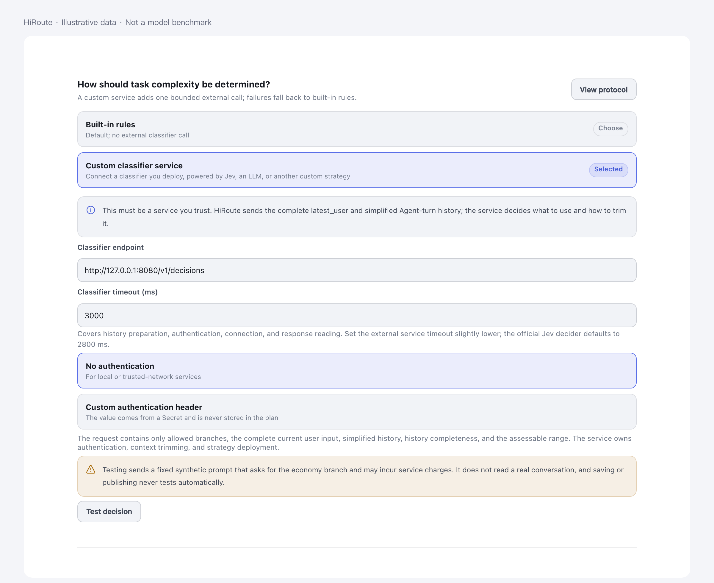
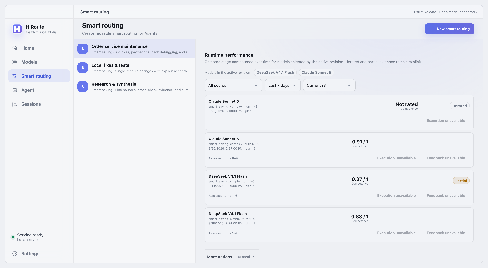
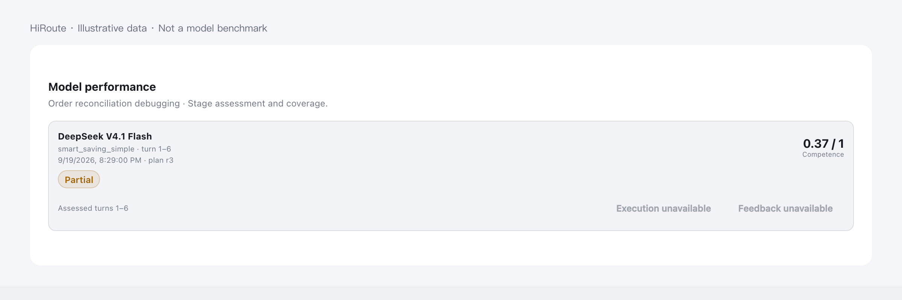

# HiRoute decision extensions

[Simplified Chinese](README.zh-CN.md) · [Decision API](api/README.md) · [Official Jev extension](extensions/jev-decider/README.md)

HiRoute can ask a trusted decision service which branch should handle a routing execution round. The same response can assess how well the model handled the preceding execution stage. The protocol describes branch decisions and competence assessments; it is not inherently a simple/complex binary classifier. The current smart-saving integration supplies two branches, while the API's `branches` map and the Jev extension's `auto` mode support multiple allowed branches. This does not add new routing modes to the current product.

## Start with the official extension

Deploy the [Jev service](extensions/jev-decider/README.md), backed by one OpenRouter Jev request per decision. In a smart-saving plan, select the custom classification service, set its full endpoint to `http://127.0.0.1:8080/v1/decisions`, and configure the timeout and optional authentication header. Use the explicit test action before publishing. Saving or publishing does not invoke the service.



All screenshots here use synthetic data rendered with real product components; [their evidence boundary](#illustration-evidence-boundaries) distinguishes them from native or live-provider acceptance evidence.

## When a decision takes effect

```text
No inheritable decision OR appended user input OR no ContextHold preference
  → choose branch + optionally assess the prior stage
  → model request(s) inherit while ContextHold remains valid
  → the next decision boundary seals this routing execution round
```

HiRoute decides again whenever no valid decision can be inherited, a real user message is appended to history that ContextHold proved continuous, or ContextHold no longer supplies a preferred candidate. It does not ask the service to detect compaction and does not require the latest user text to change. A replay or tool continuation with a valid hold and decision reuses the frozen branch. A failed model candidate can still trigger the plan's existing failover within a round; that is an execution fallback, not a new classification. HiRoute records a different executed branch when accepted output came entirely from that fallback branch. Mixed-model output is not attributed as the competence of one model.

A routing execution round is one decision plus the model requests that inherit it; one user task can span several rounds. A stage can span several rounds when the plan revision, selected and executed branch, actual model configuration, and effective profile remain the same. Credential rotation alone does not create a new stage. Internal model identities stay in HiRoute; the decision service sees branch meanings and observed round activity, not a model ID on every step.

## What each side owns

| HiRoute | Decision service |
| --- | --- |
| Allowed branches, decision boundaries and actual execution | Branch-selection policy, prompts and model calls |
| Complete current user projection and retained routing-round history | Context selection and trimming for its own model limit |
| Deadline, cancellation and local-rules fallback on service failure | Deployment, upstream credentials and optional inbound authentication |
| Assessment target, model/plan attribution and durable latest stage score | Optional competence score and truthful partial-evidence flag |

The in-memory routing-round history supplies accepted assistant text and ordered tool names/statuses. It omits tool arguments/results, system instructions and reasoning. A round sealed only because HiRoute reached another decision boundary can have `unknown` status without being failed or completed. History can be incomplete after eviction or restart; replacing client history alone does not create a gap. Current user content is not truncated to a fixed classifier budget. It is always a non-empty projection from the actual request, but it may repeat the preceding round or be a client-generated summary/continuation. Non-text content may be represented as unavailable. See the [API](api/README.md) for exact fields and failure behavior.

## Use competence to improve routing plans

**Competence guards against risky cost-cutting; complexity identifies opportunities to save.** This is the official extension's `rules` policy. Its alternative `auto` mode lets Jev choose the branch directly. Both may assess the preceding stage using current `latest_user` content together with observed execution. Explicit feedback such as an unresolved error can inform that assessment; repeated text, a summary, a continuation message, or silence is not by itself praise or a complaint.

A score in `[0,1]` means competence for that stage, not confidence, task complexity, a measured success probability or a global model ranking. A new valid assessment replaces the latest score for the same stage. An omitted assessment leaves the stored score unchanged; unscored is not zero. `partial` and the scored coverage matter, especially when the latest score covers only an earlier part of an ongoing stage. There may be no final assessment if no later decision boundary occurs.



The illustration shows an order-service maintenance plan across four separate sessions, with realistic model names and fabricated scores and times. It includes an unrated stage, partial history, and an assessment that does not yet cover the latest turn. It is not a comparison of actual model capability; Jev supplies no textual reason in these examples.

The plan's performance section shows configured models for its active revision over the selected period, without asking users to type model IDs. The session view shows stage-level performance and available evidence.



An authorized delegating agent can query the same samples, first looking for weak stages and then inspecting retained session evidence:

```sh
hiroute observation plan-quality samples --plan-id plan/code-maintenance --score-lt 0.5 --output json
hiroute observation plan-quality samples --plan-id plan/code-maintenance --score-gt 0.8 --output json
```

Replace the example plan ID with a real one. Bounds are strict; unscored stages do not match score filters. The CLI also supports session, revision, exact model, time and pagination filters. Evidence access follows the existing content-retention and authorization rules.

For example, repeated samples might show that an economical model handles local fixes well but struggles with cross-module changes. A main agent can propose a specialized local-fix plan and delegate broader work to a stronger model, then evaluate subsequent samples. Compare task evidence, versions and partial coverage before drawing that conclusion. HiRoute does not automatically create plans, retrain a selector or treat one low score as a model verdict.

## Build another extension

Implement the [five-field HTTP JSON contract](api/README.md) using Jev, an LLM or your own policy. Return one of the supplied branch IDs and, optionally, an assessment of the requested prior stage. Provider-specific formats and context limits belong inside your service. The [official extension](extensions/jev-decider/README.md) includes deployment instructions and offline tests of the real HTTP handler.

<span id="illustration-evidence-boundaries"></span>

## Illustration evidence boundaries

The configuration and performance images are captured from current HiRoute product components populated with synthetic plans, sessions, scores and times. They demonstrate the documented layout and states; they are not native WebView acceptance evidence, live Jev responses or comparative model benchmarks. Product and provider validation remains attached to its exact test evidence rather than inferred from these illustrations.
