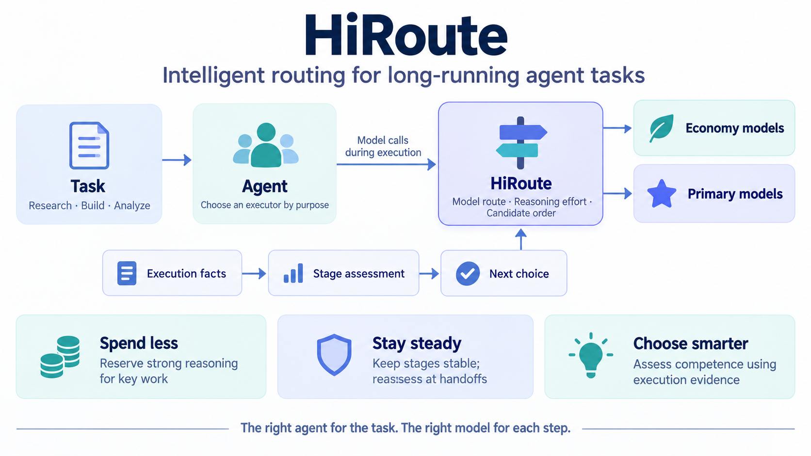
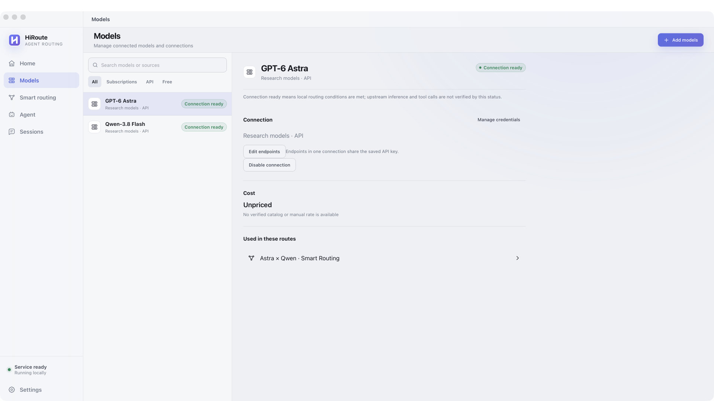
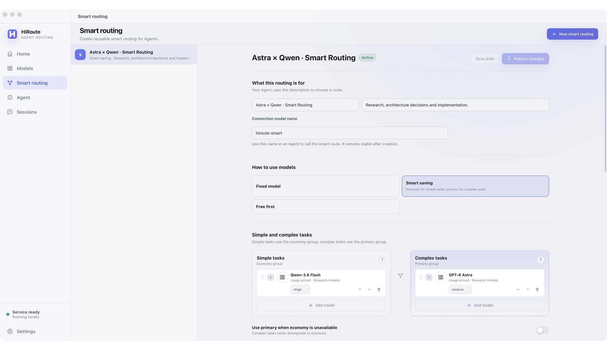
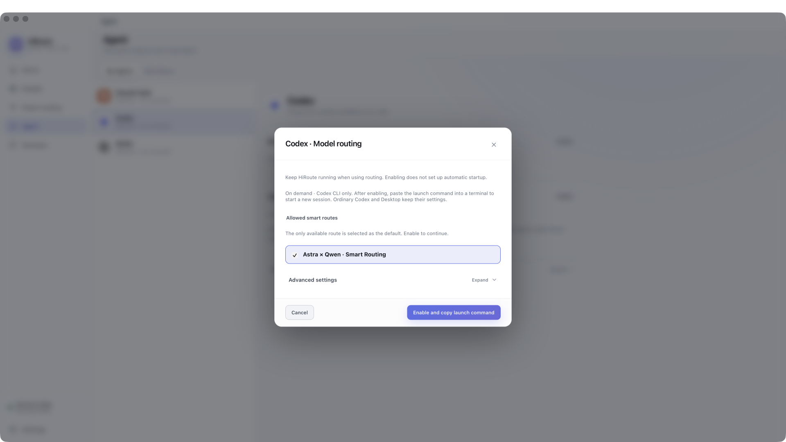
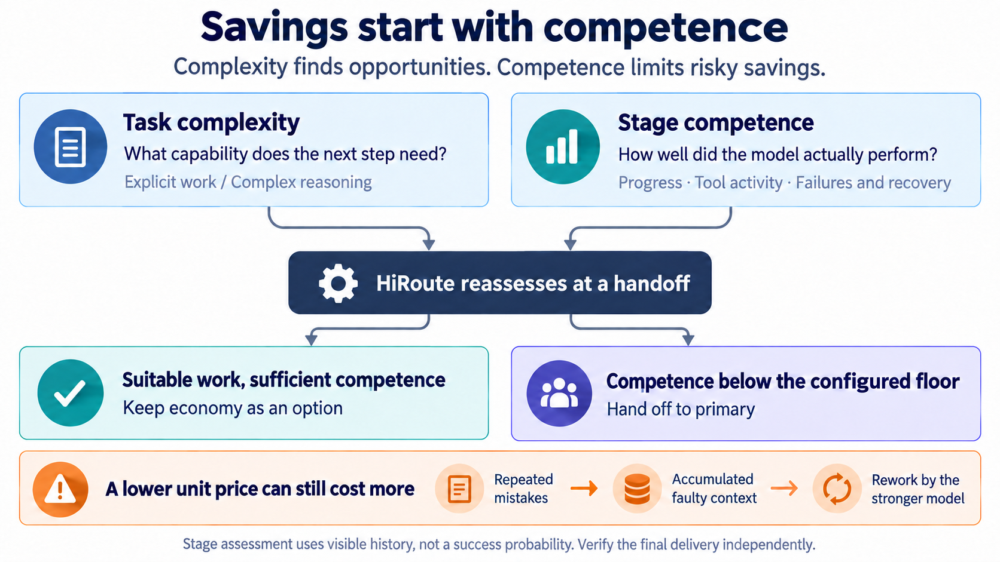

# HiRoute Smart Routing in Action: GPT-6 Astra × Qwen-3.8 Flash, Same Quality at 90% Lower Cost

**How much can you save by reserving your strongest model for the decisions that need it?**

We connected GPT-6 Astra and Qwen-3.8 Flash through one HiRoute routing plan, then put them to work on an engineering assignment spanning technical research and architecture review. In two runs meeting the same whole-delivery acceptance standard, the mixed setup cost **92.01% and 91.39% less** than all-Astra execution.

A separate coding task, lasting about 32 minutes, demonstrated the other side of smart routing. When the economy model kept researching without moving into implementation, HiRoute automatically upgraded the model at a context handoff. Development continued, and the result passed **343 independent checks**. Nobody added a prompt or manually switched models during the task.

Both cases illustrate the same idea: **a long-running task benefits from the right capability at each stage.**

## HiRoute adds smart routing to the agent you already use

HiRoute is an open-source routing engine that runs locally between your existing agent and model services, designed for long-running tasks. You keep asking Codex, Claude Code, or another supported agent to do the work. The agent still reads files, writes code, and runs tests. HiRoute decides which model handles each stretch of work.

Connect your models in Desktop, create a routing plan, and point the agent at it. The agent uses one stable model alias while the models behind that alias can change with the task. The Sessions page shows which model actually ran, token usage, and assessments of earlier stages.

This fits the rhythm of software development: research, design, implementation, testing, and deeper investigation when something breaks. Organizing documented facts and deriving a new system guarantee demand different capabilities. Once the hard problem is solved, every remaining step may not need the most expensive model.

## Configure two models as one HiRoute plan

The combination is straightforward: **Qwen-3.8 Flash handles routine work; GPT-6 Astra handles critical reasoning.**

### 1. Connect your model services

Use the Models page to connect your own services and make Qwen and Astra available for routing. Manage each connection once and reuse it across plans.

### 2. Create a Smart Saving plan

Open Smart Routing, choose Smart Saving, and place Qwen in the Economy group and Astra in the Primary group. This experiment used `xhigh` and `medium` reasoning settings respectively. Enable the plan, and the agent can access the combination through one model alias.

### 3. Use the plan in your existing workflow

For Codex, open Model routing on the Agent page, select the plan, then enable it and copy the launch command to start a new session through HiRoute. Issue tasks as usual. The Sessions page lets you inspect the actual models and usage request by request.

## Experiment 1: from technical research to a consequential architecture decision

We used a messaging-system design review to represent a familiar engineering workflow: research six candidate technologies, verify the official documentation, organize the comparison, and deliver a memo on a critical design decision.

The final decision asks a practical question: **if the system fails midway and retries, how do you avoid processing the same business event twice—or missing it entirely?** Finding “supports transactions” in the documentation is not enough. The model must determine whether the pieces together meet the business requirement.

The structure is widely familiar: **a substantial amount of research supports a small number of critical judgments.** Technology selection starts with feature comparisons and ends with a choice under real constraints. Migrations start with an inventory of differences and lead to decisions about risk and rollback. Compatibility reviews move from checking interfaces to identifying conflicts that affect the business. Every step needs care, but not every step needs the most expensive model.

We gave three modes the same task, source material, and delivery requirements:

| Mode | Actual division of work |
| --- | --- |
| All Astra | Astra handles research and the decision memo |
| HiRoute mixed | Qwen handles six research deliverables; Astra handles the critical decision memo |
| All Qwen | Qwen handles research and the decision memo |

HiRoute allocates capability by the work involved: Qwen organizes and verifies the research; Astra handles the critical reasoning. The stronger model takes on the portion that needs it.

### Lower cost, with the critical judgment intact

Across the two runs in which both modes passed the original whole-delivery gate, average research-check accuracy was **99.03% for HiRoute mixed** and **99.72% for all Astra**. Both passed the critical decision review. Whole-task cost fell by **91.39%–92.01%**.

The three critical decision reviews show the capability gap more clearly:

| Mode | Critical decisions without major errors |
| --- | --- |
| HiRoute mixed | **3/3** |
| All Astra | **3/3** |
| All Qwen | **1/3** |

Qwen's research work was quite accurate. The gap appeared in the final judgment: two recommendations treated a guarantee within one component as a guarantee for the whole design. Those recommendations sound complete, but they can lead to the wrong architecture decision.

The mixed setup spent Astra's reasoning capability on that decision without making Astra handle all the research. **Savings came from allocating the work; quality came from matching the critical judgment to sufficient capability.** That is the useful pattern to carry into everyday engineering tasks.

*The cost comparison uses the two of three primary runs where both modes met the original delivery standard, and includes all subject attempts and routing evaluation at API-equivalent prices. The [experiment record](../experiments/cases/research-cost-quality/README.md) retains every outcome and the acceptance criteria. “Same quality” means meeting the same delivery standard.*

## An economy model's competence needs checking during execution

A lower model price does not automatically mean a cheaper completed task. If the economy model repeatedly heads in the wrong direction, the stronger model may have to reconstruct the context, investigate mistakes, and redo the implementation. Rework can consume the savings.

HiRoute therefore considers both “How demanding is the next stage?” and, when routing is reconsidered, “How well did the previous stage go?” **Task complexity identifies opportunities to save; stage competence helps determine whether continuing to save is still sensible.**

This matters especially in long tasks. As an agent accumulates context, it compresses history and continues from a summary. HiRoute detects continuity between requests and can reconsider the model at these **context handoffs**. Ordinary tool continuations retain the current route, keeping a stretch of execution stable.

“Let a stronger model take over” can then become part of the execution process, without waiting for a person to watch the conversation, spot a problem, and intervene.

That execution feedback is also available for inspection. A session's **Model performance** view shows the actual model, competence score and assessment coverage for each execution stage. If progress looks insufficient, execution-evidence and assessment-feedback links lead back to the relevant activity. Stages that have not received a score remain visible too.

A routing plan's **Runtime performance** view provides a broader perspective. Select a plan version and time range to see each model's average stage competence, together with counts of scored and unrated stages. Open a model's stages to inspect the underlying execution and assess which combination fits your tasks. The average includes scored stages only; unrated stages do not enter the calculation.

## Experiment 2: one long task, three automatic model handoffs

The second task added synchronous and asynchronous JSON stream iteration to HTTPX. It needed to support several JSON stream formats, handle encoding and consumption state, and yield parsed values before the rest of the data arrived.

We gave native Codex one task instruction and let it continue. HiRoute started with the economy model and used a stage-competence floor of **0.5**.

The actual sequence was **Qwen → Astra → Qwen → Astra**, with three automatic model changes at handoff and reassessment opportunities. Nobody told the agent which model to use next.

### First upgrade: prepare the context handoff

Qwen began by reading source and tests and analyzing the requirements. At the first context-summary request, the preceding stage scored **0.41**, below the competence floor, so HiRoute selected Astra. The agent was preparing a context summary, and Astra handled that handoff.

The reason for this switch was straightforward: execution feedback triggered the competence guard, assigning the next request to a stronger model. Its work at this point was the summary; implementation came later.

### Return to Qwen: allocate work using stage feedback

The summary stage scored above the floor. Under the configured economy-first policy, Qwen got another opportunity to continue. A subsequent reassessment also retained Qwen.

This illustrates **ongoing model selection**: return after a handoff, retain the current model after reassessment, or upgrade based on the next stretch of work and fresh execution feedback.

### Upgrade again: turn investigation into a deliverable

The work still consisted of investigating source, tests and interfaces, without a product implementation. At the second context handoff, the stage score was **0.485**, again below the **0.5** floor. HiRoute upgraded to Astra to continue the task.

This handoff produced clear delivery progress. Astra began writing the JSON streaming implementation, ran tests, and worked through asynchronous iterator closure, encoding boundaries and type checking. The agent repaired failures encountered along the way and completed the delivery.

| This long-running task | Result |
| --- | --- |
| Start to finish | **31 minutes 36 seconds** |
| Automatic model changes | **3: two upgrades and one return to the economy model** |
| Intermediate human prompts / human code patches | **0 / 0** |
| Astra tool calls after the key upgrade | **13** |
| Independent checks after execution | **108 feature + 229 regression + 6 incrementality checks, all passing** |

**HiRoute continually applied execution feedback to model selection for the next stretch of work:** start economically, reassess at handoffs, upgrade when progress is insufficient, then let the stronger model continue implementation and validation. The user could focus on the deliverable without acting as a full-time model dispatcher. [Explore the handoff and acceptance record](../experiments/cases/unattended-engineering/handoff-notes.md).

## Download HiRoute and try your own task

The experiment procedures, results, and reproduction instructions are open source in the [HiRoute repository](../experiments/README.md).

Want to try it with your agent? **[Download HiRoute from the official website](https://hiroute.ai/en/download/)**. The macOS installer is **under 100 MB**. Install it, connect your existing model services, choose a routing plan, and get back to work in the agent you already use.
