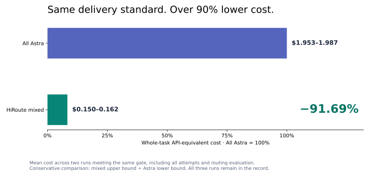
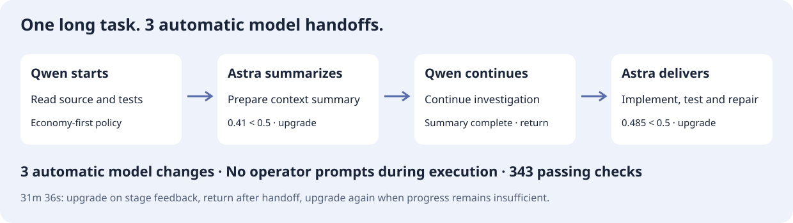

# HiRoute Smart Routing in Action: GPT-6 Astra × Qwen-3.8 Flash, Same Quality at 90% Lower Cost

A software iteration asks an agent to do many different jobs: read documentation, check configuration details, assemble evidence, implement changes, reason about failure sequences, and choose repairs. Using the most expensive model throughout means paying frontier reasoning rates for routine work too.

We tested **GPT-6 Astra + Qwen-3.8 Flash** on an engineering research workload. In two paired deliveries that met the same whole-task acceptance criteria, HiRoute's mixed mode reduced **API-equivalent cost by 92.01% and 91.39%**. Across three repeats, the mixed mode and all-Astra mode each produced **3/3 critical memos without material errors**; all-Qwen produced **1/3**.

“Same quality” here means meeting the same predefined delivery standard, not identical answers or scores. The 90% figure concerns API-equivalent costs in this research case, including routing decisions and subject calls. It is not a subscription invoice reduction or a guarantee for every task. All repetitions and scoring rules are retained in the [experiment record](../experiments/cases/research-cost-quality/README.md).



## One workflow, different demands on the model

Much of a research assignment involves finding answers already present in the supplied material. A smaller part may require combining the behavior of several systems and deriving a guarantee that no source states directly. Software implementation has the same variation: a bounded change and a subtle concurrency or recovery decision need different investments.

| Stage | Typical work | A useful allocation principle |
| --- | --- | --- |
| Research and preparation | Check documentation, normalize facts, collect evidence | Consider an economical model for explicit source-grounded work |
| Design and decisions | Reconcile constraints, transaction boundaries, failure orderings | Reserve stronger reasoning for difficult judgments |
| Implementation and verification | Make changes, execute checks, diagnose failures | Choose using the specific task and observed performance |
| Long-running execution | Continue tool loops, compact context, resume repairs | Keep a stage stable; reassess at a handoff |

These are allocation principles, not permanent labels for lifecycle stages. Implementation can require deep reasoning; research can include large amounts of straightforward work.

HiRoute puts model selection in the routing layer. The workflow or agent still decomposes the task. In this experiment, the delivery units were predefined, and HiRoute with the official Jev extension selected the model for each unit.

## Experiment one: 360 research cards and one critical decision

The workload represents preparation for a messaging-system architecture review. It covers RabbitMQ, Kafka, NATS, Pulsar, Redis Streams, and RocketMQ, with 60 distinct verification obligations per system. Each of the 360 cards needs a verdict, a factual explanation, and source-line citations.

A separate memo examines Kafka and SQL transaction semantics: safety, liveness, failure windows, and whether proposed repairs deliver the requested guarantees.

The task requires substantial work without an artificial minimum word count. Research cards must answer the actual question concisely; the critical memo can be short. The difficult part is the density of reasoning, not the length of the answer.

We compared three modes:

- **All Astra:** Astra handles every delivery unit.
- **HiRoute mixed:** the same work enters smart routing. Actual records show Qwen handling six research components and Astra handling the critical memo.
- **All Qwen:** Qwen handles the same delivery requirements through a fixed route.

Jev used generic criteria: explicit extraction, translation, verification, and formatting could use economy; novel guarantees, conflicting evidence, or complex failure interactions required primary. Product names and hidden reference answers were not used to assign models. Subject models received the complete frozen sources; Jev saw the current task, claims, and source metadata.

## Where the savings come from, and where quality matters

The following pairs passed the original whole-delivery gate: all 360 cards delivered, at least 353 correct, and no material error anywhere in the critical memo.

| Pair | HiRoute mixed research cards | All-Astra research cards | Mixed / Astra critical memo | Conservative cost reduction |
| --- | --- | --- | --- | --- |
| Pair 2 | 357/360 | 359/360 | Pass / Pass | **92.01%** |
| Pair 3 | 356/360 | 359/360 | Pass / Pass | **91.39%** |

Costs include subject attempts and Jev decisions, using frozen API tariffs and exchange rates. The conservative reduction compares the mixed upper cost bound against the all-Astra lower bound. This table presents the two pairs that passed the original gate; all three pairs remain in the experiment record.

The critical recommendations are particularly revealing:

| Mode | Critical memos without material errors |
| --- | --- |
| HiRoute mixed | **3/3** |
| All Astra | **3/3** |
| All Qwen | **1/3** |

The two all-Qwen failures were not JSON formatting mistakes. Some repair suggestions treated a local transaction binding SQL state and offsets, or an outbox, as a solution for atomic visibility across SQL and an independent Kafka output. Those techniques have legitimate uses, but do not alone remove the cross-system visibility window required by the task.

That is the value of the allocation: economical models can perform much of the evidence work, while a small number of consequential judgments justify stronger reasoning. All-Qwen's research-card accuracy was itself close to the mixed mode; the meaningful gap appeared in the critical recommendations.

## Automatic model handoff for long tasks

A good initial choice is only the beginning. A long task invokes tools, encounters failures, repairs code, and eventually compacts its growing context. The model that fitted the beginning may not fit every later stage.

HiRoute uses **automatic model handoff** at natural transitions:

1. Ordinary tool continuations inherit the current route.
2. When message history can no longer be inherited, such as after context compaction and rebuilding, routing can decide again.
3. Jev uses the current task and visible execution history to select the next branch and optionally assess the previous stage's competence.
4. If the current assessment falls below the configured floor, the Rules policy blocks the economy branch and selects primary.

ContextHold provides the underlying continuity check. Clients do not need to emit a separate compaction notification, and reassessment can keep the same model. The score informs routing; final acceptance still determines quality. Models do not share KV caches: a handoff builds a new prefix, which subsequent calls can reuse.

## Experiment two: one instruction, about 32 minutes, 343 passing assertions

To test autonomous handoff, we used a pinned HTTPX coding task: add synchronous and asynchronous streaming JSON iteration, correctly handle JSON, NDJSON, JSON text sequences, encodings, and stream-consumption state, and yield available values before requesting the rest of the body.

A native agent executed code and tools. The initial task required both implementation and verification; no operator guidance or product-code patches were supplied during execution.



| Observation | Recorded result |
| --- | --- |
| Initial task instructions | 1 |
| Intermediate operator prompts / manual code patches | **0 / 0** |
| Native execution time | **31 min 36 sec** |
| Actual model requests | 25 Qwen, 15 Astra |
| Upgrade after the second compaction | Competence **0.485**, below the **0.5** floor |
| Actual subsequent execution | 13 Astra tool calls |
| Independent acceptance | **108 feature + 229 regression + 6 incrementality assertions, all passing** |

Independent verification followed execution, with protected tests unchanged. This case demonstrates an actual automatic upgrade followed by accepted completion. It has no all-Astra cost control and does not support a 90% savings claim. [Task, parameters, and verification](../experiments/cases/unattended-engineering/README.md)

## Try it in your workflow

Connect Astra and Qwen, then create a smart-saving plan with Qwen in the economy branch and Astra in primary. To select using complexity and execution evidence, configure the [official Jev extension](../decision-extensions/extensions/jev-decider/README.md).

The research case used a simple-task threshold of 0.8 and competence floor of 0.5. The long-task case used an economy-first threshold of 0 and the same 0.5 floor to observe autonomous escalation. These are different policies for different experiments, not a universal optimal configuration.

After connecting your agent, inspect the actual models, route decisions, and usage in HiRoute's session records. Configuration labels alone do not establish that the intended route ran.

Start with [HiRoute installation](https://hiroute.ai/en/download/), or recalculate the published results without making model calls:

```sh
python3 experiments/reproduce.py verify
python3 experiments/reproduce.py report
```

The [experiments directory](../experiments/README.md) includes complete deliveries, item-level findings, cost provenance, tasks, and rerun entry points. Offline replay makes no model calls; fresh execution uses your own connections and writes separate results. Semantic review still requires reading every answer against its sources; structure checks alone are not quality grades.

These are purpose-selected cases with three repeats per research mode and unblinded evaluation, not population-wide estimates. The complete original acceptance results, supplementary analysis, and transport-recovery records are published with the experiments.

Invest model capability where it matters, let economical models carry routine work, and let long tasks hand off when needed. That is the workflow HiRoute is built to support.
