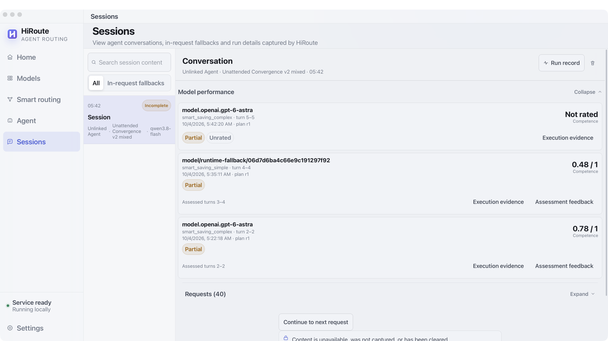

# HiRoute Smart Routing in Action: GPT-6 Astra × Qwen-3.8 Flash, Same Quality at 90% Lower Cost

**HiRoute: an open-source intelligent routing engine for long-running agent tasks. Spend less. Stay steady. Choose smarter.**

The right agent for the task. The right model for each step.

An agent working for tens of minutes may research a problem, reconcile constraints, implement changes, run tests, diagnose failures, and repair its work before delivery. Much of that work is well bounded; a few difficult judgments can determine the outcome. Model selection needs to keep pace with the task.

We put **GPT-6 Astra + Qwen-3.8 Flash** through two kinds of practical work. In two engineering-research pairs meeting the same delivery standard, mixed routing reduced **API-equivalent cost by 92.01% and 91.39%**. In a separate real coding task, an agent **received no intermediate operator guidance and passed 343 independent assertions after automatic model handoff**. The first case tests cost-effective allocation; the second observes autonomous escalation and completion.

## Why long tasks need intelligent routing

A software iteration continually changes what it asks of a model. Research needs coverage and accuracy; architecture decisions need reasoning about constraints and failure boundaries; implementation needs tool execution and sustained verification. Even within one stage, straightforward edits and difficult debugging can alternate.

Model capabilities, reasoning settings, prices, and availability differ. Research, coding, and complex analysis can also benefit from different agent workflows. Longer tasks make three questions increasingly relevant: **Is the capability appropriate? Can execution continue? What does completing the entire task cost?**

HiRoute brings those decisions into one engine:

- **Task routing:** the primary agent selects an allowed work plan by purpose; that plan specifies an execution agent and its model route.
- **Model routing:** within the plan's allowed scope, select a model combination, reasoning setting, and candidate order for the work.
- **Execution observability:** associate actual models, attempts, usage, estimated costs, and available stage assessments for users and agents to inspect.

Desktop provides configuration and observation, the CLI supports automation, and the Gateway handles model calls. Keep working in a familiar agent through a supported integration. Task decomposition remains the agent's or workflow's responsibility; this article tests model routing and long-task handoff.


## Spend less. Stay steady. Choose smarter.

**Spend less: reserve stronger reasoning for work that benefits from it.** Explicit extraction, verification, and organization can be candidates for economical models; deriving guarantees and analyzing complex failures justify stronger models. Configuring reasoning effort alongside models also avoids maximum effort on every task.

**Stay steady: hand off at appropriate boundaries.** Ordinary tool continuations keep their existing route. A fresh decision opportunity allows reassessment. When a source is unavailable, failure recovery follows the plan, candidate order, and capability requirements; a response already being delivered does not transparently switch models midway. Capability escalation at a context boundary and recovery from a failed request have distinct triggers.

**Choose smarter: use performance to calibrate the initial choice.** A task description provides an initial signal. Actual progress, repeated mistakes, and substantial corrections add evidence. HiRoute associates visible execution facts with stage assessments, making subsequent choices inspectable and helping users understand which work a model handles well.

Together, these capabilities aim to **reduce the cost of reliably completing an entire task while reducing manual model selection, supervision, and switching.**

## A cheaper model can create a more expensive task

When an economical model completes most of the work and a stronger model handles a few difficult decisions, mixed routing can save substantially. But if the economical model repeatedly takes the wrong path, the stronger model may need to reconstruct context, diagnose mistakes, and redo the implementation. You have paid for the first attempt and for the cleanup.

Extra attempts, growing context, and rework can consume the unit-price advantage. The relevant accounting is:

> **Whole-task cost = productive execution + failed attempts and rework + routing evaluation.**

HiRoute therefore distinguishes two questions:

| Assessment | Question | Role in routing |
| --- | --- | --- |
| Task complexity | What capability does the next piece of work require? | Identify suitable opportunities to use economy |
| Stage competence | How well did the selected model actually handle the preceding work? | Stop pursuing savings when observed performance is inadequate |

The competence assessment used in this case considers answers and tool activity visible to the routing layer, failed and recovered attempts, and available user feedback. It looks back at an assessable stage of execution. Useful progress with an appropriate process and no material correction differs from repeated errors and limited progress.

**The score concerns a particular stage. It is neither a permanent model ranking nor a probability of success.** A missing assessment is not a zero; incomplete visible history must be interpreted alongside its coverage. Independent acceptance still determines whether the final delivery meets requirements.


## Automatic model handoff for long tasks

Assessment becomes useful when it informs the next action. HiRoute can reconsider at new user input and natural handoffs where the existing context can no longer be inherited. Compaction followed by rebuilding context is a common example during a long task.

Ordinary tool continuations remain stable. At a handoff, assess the current task and the preceding stage. When the current competence assessment is below the configured floor, the policy used in this experiment blocks the economy branch and selects primary. A new decision can also keep the same model when it remains suitable.

This does not depend on someone watching and asking for a stronger model. ContextHold checks context continuity without requiring a separate client compaction notification. **Feedback is evaluated at decision opportunities, not as a real-time error detector after every tool call**, and compaction does not automatically require an upgrade.

Different models cannot share a KV cache. Switching builds a new prefix that subsequent calls may reuse. Choosing at a point where context already needs rebuilding helps preserve stability across ordinary continuations.

## How this case was configured

The smart-saving plan puts **Qwen-3.8 Flash** in economy and **GPT-6 Astra** in primary, with reasoning effort configured for each. The subject client uses the appropriate plan; actual execution models and usage are checked in the resulting records.

| Setting | Research cost experiment | Long-task handoff experiment |
| --- | --- | --- |
| Economy model | Qwen-3.8 Flash, xhigh | Qwen-3.8 Flash, xhigh |
| Primary model | GPT-6 Astra, medium | GPT-6 Astra, medium |
| Simple-task threshold | 0.8 | 0, economy-first start |
| Competence floor | 0.5 | 0.5 |
| Outcome of interest | Whole-task cost at the same acceptance standard | Autonomous escalation and completion without intermediate guidance |

The cases have different purposes and starting policies. Research reserves primary for consequential judgments; the long task observes whether execution starting with economy can hand off based on performance. These are not universal optimal settings. Exact versions, policies, and complete parameters remain in the [experiment directory](../experiments/README.md).

To inspect the effect, first look at **actual execution models and attempts** in the session, then stage competence and assessment coverage, and finally independent delivery acceptance. Configuration, an assessment, and a completed deliverable provide different kinds of evidence.

## Experiment one: 360 research cards and one critical decision

The workload represents preparation for a messaging-system architecture review. It covers RabbitMQ, Kafka, NATS, Pulsar, Redis Streams, and RocketMQ, with 60 distinct verification obligations per system. Each of the 360 cards needs a verdict, a factual explanation, and source-line citations.

A separate memo examines Kafka and SQL transaction semantics: safety, liveness, failure windows, and whether proposed repairs deliver the requested guarantees.

The task requires substantial work without an artificial minimum word count. Research cards must answer the actual question concisely; the critical memo can be short. The difficult part is the density of reasoning, not the length of the answer.

We compared three modes:

- **All Astra:** Astra handles every delivery unit.
- **HiRoute mixed:** the same work enters smart routing. Actual records show Qwen handling six research components and Astra handling the critical memo.
- **All Qwen:** Qwen handles the same delivery requirements through a fixed route.

Routing used generic criteria: explicit extraction, translation, verification, and formatting could use economy; novel guarantees, conflicting evidence, or complex failure interactions required primary. Product names and hidden reference answers were not used to assign models. Subject models received the complete frozen sources; the routing evaluation saw the current task, claims, and source metadata.

## Where the savings come from, and where quality matters


The following pairs passed the original whole-delivery gate: all 360 cards delivered, at least 353 correct, and no material error anywhere in the critical memo.

| Pair | HiRoute mixed research cards | All-Astra research cards | Mixed / Astra critical memo | Conservative cost reduction |
| --- | --- | --- | --- | --- |
| Pair 2 | 357/360 | 359/360 | Pass / Pass | **92.01%** |
| Pair 3 | 356/360 | 359/360 | Pass / Pass | **91.39%** |

Costs include subject attempts and routing evaluations, using frozen API tariffs and exchange rates. The conservative reduction compares the mixed upper cost bound against the all-Astra lower bound. This table presents the two pairs that passed the original gate; all three pairs remain in the experiment record.

The critical recommendations are particularly revealing:

| Mode | Critical memos without material errors |
| --- | --- |
| HiRoute mixed | **3/3** |
| All Astra | **3/3** |
| All Qwen | **1/3** |

The two all-Qwen failures were not JSON formatting mistakes. Some repair suggestions treated a local transaction binding SQL state and offsets, or an outbox, as a solution for atomic visibility across SQL and an independent Kafka output. Those techniques have legitimate uses, but do not alone remove the cross-system visibility window required by the task.

That is the value of the allocation: economical models can perform much of the evidence work, while a small number of consequential judgments justify stronger reasoning. All-Qwen's research-card accuracy was itself close to the mixed mode; the meaningful gap appeared in the critical recommendations.

## Experiment two: one instruction, about 32 minutes, 343 passing assertions

To test autonomous handoff, we used a pinned HTTPX coding task: add synchronous and asynchronous streaming JSON iteration, correctly handle JSON, NDJSON, JSON text sequences, encodings, and stream-consumption state, and yield available values before requesting the rest of the body.

A native agent executed code and tools. The initial task required both implementation and verification; no operator guidance or product-code patches were supplied during execution.


| Observation | Recorded result |
| --- | --- |
| Initial task instructions | 1 |
| Intermediate operator prompts / manual code patches | **0 / 0** |
| Native execution time | **31 min 36 sec** |
| Actual model requests | 25 Qwen, 15 Astra |
| Upgrade after the second compaction | Competence **0.485**, below the **0.5** floor |
| Actual subsequent execution | 13 Astra tool calls |
| Independent acceptance | **108 feature + 229 regression + 6 incrementality assertions, all passing** |

Independent verification followed execution, with protected tests unchanged. This case demonstrates an actual automatic upgrade followed by accepted completion. It has no all-Astra cost control and does not support a 90% savings claim. [Task, parameters, and verification](../experiments/cases/unattended-engineering/README.md)

### Inspecting the handoff in Desktop



This screenshot replays historical observation metadata from the experiment in an isolated native Desktop. It shows stage scores, assessed turns, and evidence links. It was captured after the experiment without rerunning the model task. Conversation content and agent connection configuration were not imported, so the incomplete-content and unlinked-agent indicators remain visible. The stage-level “Partial” badges describe the original assessment coverage, not failed delivery. The UI displays two decimal places; the escalation used the recorded value **0.485**.

## Start with a long task of your own

Choose a familiar task with a clear acceptance standard. Connect model sources, create a route in Desktop, connect your preferred agent, and inspect actual execution in the session record. Your own execution evidence can help identify which work suits economy and which needs stronger reasoning.

“Same quality” in this article means meeting the same predefined delivery standard, not identical answers or scores. The 90% figure concerns API-equivalent costs for two accepted research pairs, including subject calls and routing evaluation. It is not a subscription-invoice reduction or a promise for every task. The long-task case demonstrates autonomous handoff and completion, with no cost-savings claim.

Start with [HiRoute installation](https://hiroute.ai/en/download/), or recalculate the published results without model calls:

```sh
python3 experiments/reproduce.py verify
python3 experiments/reproduce.py report
```

The [experiments directory](../experiments/README.md) preserves all nine research deliveries, item-level findings, cost provenance, tasks, and rerun entry points. Offline replay makes no model calls; fresh execution uses your own connections and writes separate results. Semantic review still requires reading every answer against its sources; structure checks alone are not quality grades.

These are purpose-designed cases with three research repeats per mode and unblinded evaluation. Complete original records, supplementary analysis, and transport recovery remain available for inspection under the same definitions.

**HiRoute. Spend less. Stay steady. Choose smarter. The right agent for the task. The right model for each step.**
