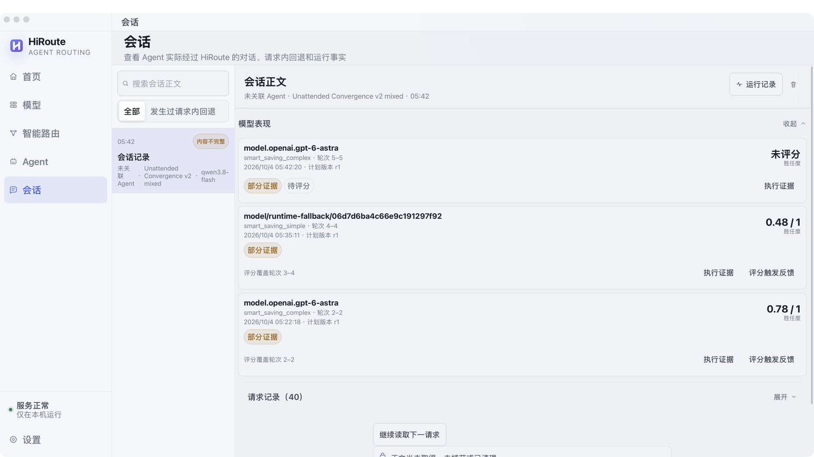

# HiRoute 智能路由实战：GPT-6 Astra × Qwen-3.8 Flash，同等质量下成本降低 90%

**HiRoute：面向长程任务的开源智能路由引擎。更省，更稳，更懂。**

让合适的 Agent 接住任务，让合适的模型完成每一步。

一个 Agent 连续工作几十分钟，可能先读资料、梳理约束，再编写实现、运行测试、分析失败，最后修复并交付。这段路程中，有大量边界清晰的工作，也有少数决定成败的复杂判断。模型选择需要跟着任务推进。

我们用 **GPT-6 Astra + Qwen-3.8 Flash** 做了两类实战。在两组达到相同交付验收标准的工程研究配对中，混合模式的 **API 等价成本分别降低 92.01% 和 91.39%**；在另一个真实代码任务中，Agent **没有中途人工指导，自动接力后通过 343 项独立验收**。前者验证能力分工能否降本，后者观察长任务能否在需要时升级并继续收敛。

## 为什么长程任务需要智能路由

一次软件迭代里，对模型的要求不断变化：资料核验需要覆盖面和准确性，架构设计需要理解约束与故障边界，代码实现需要工具执行与持续验证。即使在同一阶段，简单修改与复杂排错也可能交替出现。

与此同时，模型能力、思考档位、价格和可用性各不相同。研究、编码、复杂分析也可能有各自更适合的 Agent 工作流。任务越长，越需要持续回答三个问题：**当前能力是否合适，执行能否继续，整项工作花了多少成本？**

HiRoute 将这些选择放进同一套引擎：

- **任务路由**：主 Agent 按用途选择已开放的任务方案，由方案确定执行 Agent 与模型路由。
- **模型路由**：在计划允许的范围内，为当前工作选择模型组合、思考档位及候选顺序。
- **执行观测**：把实际模型、尝试过程、用量、费用估算与可用的阶段评估关联起来，供用户和 Agent 查看。

Desktop 提供配置与观测界面，CLI 支持自动化，Gateway 承载模型调用。你可以继续使用惯用的 Agent，通过支持的接入方式使用 HiRoute。任务拆解仍由 Agent 或工作流完成；本文重点验证模型路由与长任务接力。

[](assets/long-horizon-engine-zh.png)

点击配图可查看原图。

## 更省、更稳、更懂，分别解决什么问题

**更省：把强推理留给值得投入的工作。** 明确的资料抽取、核验、整理可以优先考虑经济模型；需要推导保证、分析复杂故障的工作交给主力模型。模型与思考档位一起配置，也能避免对所有任务一律使用最高投入。

**更稳：让自主执行在合适的边界接力。** 普通工具续轮维持已有路由；遇到重新决策的机会，再判断是否需要换模。来源不可用时，故障接力遵守计划、候选顺序和能力要求，已经开始交付的回答不会中途透明换模。上下文交接处的能力升级与请求故障后的备用接力，各有自己的触发条件。

**更懂：用实际表现校准最初的判断。** 任务描述只能提供初始线索。真正执行后，有没有有效推进、是否反复犯错、是否需要大幅修正，会提供更多依据。HiRoute 将可见执行事实与阶段评估关联起来，让后续选择有迹可循，也让用户知道模型在什么工作上值得信任。

这些能力共同服务于一个目标：**降低可靠完成整项任务的成本，减少长程执行中人工选型、盯盘和切换的负担。**

## 低价不一定省钱：为什么必须评估胜任度

如果经济模型能完成大部分工作，主力模型只处理少数难点，混合方案就有机会明显降本。但如果经济模型反复走错方向，随后主力模型还要重新理解上下文、排查错误并重做实现，就会出现“便宜的模型先做一遍，贵的模型再来收拾残局”。

这时，额外的尝试、变长的上下文与返工，都可能吃掉单价优势。应关注的是：

> **整单成本 = 有效执行开销 + 失败重试与返工开销 + 路由评估开销。**

因此，HiRoute 的路由评估区分两个问题：

| 判断 | 回答的问题 | 对路由的作用 |
| --- | --- | --- |
| 任务复杂度 | 接下来这段工作需要什么能力？ | 为适合经济模型的工作提供降本机会 |
| 阶段胜任度 | 刚才使用的模型，实际做得怎么样？ | 在表现不足时，阻止继续冒险降本 |

本次实战采用的胜任度评估，结合路由层可见的回答、工具活动、失败与恢复情况，以及可用的用户反馈，回看此前可评估的执行阶段。持续推进、过程合理且没有重大修正需求，与反复出错、进展有限，会得到不同评价。

**评分针对具体阶段，不是模型的永久排名，也不是成功概率。** 缺失评分不等于零分；可见历史不完整时，评估覆盖范围也需要一起看。最终交付是否合格，仍由独立验收决定。

[](assets/competence-feedback-zh.png)

## 长任务自动模型接力：把反馈用于下一段执行

阶段评估需要落到后续行动，才能减少持续试错。HiRoute 在新用户输入，以及上下文无法继续继承等自然交接点，获得重新判断的机会。Agent 压缩历史、重建上下文，就是长任务中常见的一类机会。

普通工具续轮仍保持稳定；到达交接点后，评估当前任务与此前阶段。如果本次胜任度低于配置下限，本实验的路由策略会阻止继续选择经济分支，由主力模型接续。若原分支仍合适，也可以继续使用同一模型。

这个过程不依赖人守在旁边补一句“换个更强的模型”。底层由 ContextHold 判断上下文连续性，客户端无需额外报告压缩事件。**反馈发生在决策机会，不是每次工具调用后的实时判错**，也不意味着每次压缩都必须升级。

不同模型不能共享 KV cache；换模会建立新前缀，随后才有机会继续复用。将选择放在需要重建上下文的边界，有助于保持普通续轮的稳定性。

## 这次实战如何设置

在智能省钱计划中，将 **Qwen-3.8 Flash** 放入经济分支，将 **GPT-6 Astra** 放入主力分支，并分别配置思考档位。然后让受试客户端使用相应计划，核对实际记录中的执行模型与用量。

| 设置 | 工程研究降本实验 | 长任务接力实验 |
| --- | --- | --- |
| 经济模型 | Qwen-3.8 Flash，xhigh | Qwen-3.8 Flash，xhigh |
| 主力模型 | GPT-6 Astra，medium | GPT-6 Astra，medium |
| 简单任务阈值 | 0.8 | 0，经济模型优先起步 |
| 胜任度下限 | 0.5 | 0.5 |
| 关注结果 | 同一验收标准下的整单成本 | 无中途人工干预的升级与完成情况 |

两个实验有不同目的，所以采用不同的起步策略。研究案例要求把主力模型留给关键判断；长任务案例观察经济模型开始执行后，能否依据表现自动接力。这些参数不是所有任务的通用最优值。具体版本、策略与完整参数保存在[实验目录](../experiments/README.md)。

观察效果时，先看会话里的**实际执行模型与尝试记录**，再看适用阶段的胜任度及其覆盖范围，最后结合独立交付验收。配置名称、一次评分和最终交付，是三个不同层面的事实。

## 实验一：360 条研究资料，加一个真正需要推理的决策

任务模拟一次消息系统架构评审的准备工作，覆盖 RabbitMQ、Kafka、NATS、Pulsar、Redis Streams 和 RocketMQ。每个系统有 60 个不同的核验项，共 360 条；每条都要给出判断、事实解释和来源行号。

接下来还要完成一份 Kafka 与 SQL 协作的事务语义备忘录：分析给定方案的安全性、活性、故障窗口，以及修复建议能否兑现要求。

这个任务需要大量工作量，但没有要求模型凑字数。资料部分限制为直接回答核验项，关键决策部分保持简洁。真正考验强模型的是推理密度，而不是输出长度。

我们比较三种模式：

- **全 Astra**：所有交付单元使用 Astra。
- **HiRoute 混合**：相同任务进入智能路由；实际记录显示六份资料整理使用 Qwen，关键备忘录使用 Astra。
- **全 Qwen**：相同交付要求，固定使用 Qwen。

混合组的判断规则是通用的：来源中明确存在的抽取、翻译、核验和整理工作可考虑经济模型；需要推导新保证、处理矛盾或分析复杂失败交互的工作交给主力模型。规则没有使用产品名称或隐藏参考答案指定模型。完整冻结资料提供给受试模型，路由评估看到当前任务、核验项和来源元数据。

## 便宜在哪里，质量守在哪里

[](assets/research-cost-zh.svg)

两组通过原定整单验收的配对结果如下。验收要求是完整交付 360 条，其中至少 353 条正确，且关键备忘录无重大错误。

| 配对 | HiRoute 混合资料核验 | 全 Astra 资料核验 | 混合关键决策 / Astra 关键决策 | 保守成本降幅 |
| --- | --- | --- | --- | --- |
| 第 2 组 | 357/360 | 359/360 | 通过 / 通过 | **92.01%** |
| 第 3 组 | 356/360 | 359/360 | 通过 / 通过 | **91.39%** |

成本按全部受试尝试及路由评估核算，使用冻结的 API 价格和汇率。保守降幅用混合组成本上界除以全 Astra 成本下界计算。上表展示通过原定验收的两组，三个配对的完整结果均保留在实验记录中。

质量差异最值得关注的是关键建议。在三次完整备忘录审查中：

| 模式 | 关键决策无重大错误 |
| --- | --- |
| HiRoute 混合 | **3/3** |
| 全 Astra | **3/3** |
| 全 Qwen | **1/3** |

全 Qwen 的两次问题并非 JSON 格式错误。它在某些修复建议里，把 SQL 状态与偏移的本地事务绑定，或 outbox 方案，作为 SQL 与独立 Kafka 输出跨系统原子可见性的解决方案。这些手段有各自适用的价值，但仅靠它们不能消除题设要求下的跨系统可见性窗口。

这解释了混合路由的价值：大量资料工作可以使用经济模型，而少数影响方案可靠性的关键判断值得投入更强推理。全 Qwen 的资料整理准确率本身接近混合组；差距出现在决策环节。

## 实验二：一次指令，约 32 分钟，343 项验收通过

为了验证自动接力，我们另选了一个固定版本的 HTTPX 软件修改任务：增加同步与异步 JSON 流式迭代，正确处理 JSON、NDJSON、JSON text sequence、编码和流消费状态，并确保能在剩余数据到达前产出已解析的值。

这次使用原生 Agent 执行代码和工具，而不是只提交一次文本请求。任务同时要求实现和验证，运行中不允许人工追加指导或修改产品代码。

[](assets/unattended-handoff-zh.svg)

| 观察项 | 实际结果 |
| --- | --- |
| 初始任务指令 | 1 条 |
| 中途人工提示 / 人工代码补丁 | **0 / 0** |
| 原生任务运行时间 | **31 分 36 秒** |
| 实际模型请求 | Qwen 25 次，Astra 15 次 |
| 第二次压缩后的升级 | 阶段胜任度 **0.485**，低于 **0.5** 下限 |
| 升级后的实际操作 | 13 次 Astra 工具调用 |
| 独立验收 | **108 项功能 + 229 项回归 + 6 项增量性断言，全部通过** |

验收在执行结束后独立进行，原有受保护测试保持不变。这个案例展示了实际发生的自动升级和完成结果；它没有全 Astra 成本对照，因此不用于宣称节省 90%。[任务、参数与验证方法](../experiments/cases/unattended-engineering/README.md)

### 在 Desktop 里看到这次接力

[](assets/desktop-session-quality-zh.png)

上图是在隔离的原生 Desktop 中回放本次实验的历史观测元数据，展示阶段评分、覆盖轮次与证据入口。截图补拍于实验结束后，未重新执行模型任务。会话正文与 Agent 连接配置没有导入，因此保留了“内容不完整”和“未关联”提示；阶段上的“部分证据”则是原记录的评估覆盖标记，不是交付失败。界面保留两位小数，升级判断使用记录中的原始值 **0.485**。

## 从自己的长任务开始

挑一个你熟悉、验收标准明确的任务：准备模型来源，在 Desktop 建立路由计划，连接惯用 Agent，然后在会话记录中检查实际执行。哪些工作适合经济模型，哪些工作需要更强推理，可以从自己的执行事实中逐步判断。

本文“同等质量”指达到相同的预定交付标准，不是回答或评分完全一致。90% 对应研究案例中两组达标配对的 API 等价成本，包含受试调用和路由评估；不是订阅账单降幅，也不是所有任务的承诺。长任务案例用于展示自主接力与任务完成，不主张成本节省。

从 [HiRoute 安装入口](https://hiroute.ai/download/)开始，或者先离线重算本文结果：

```sh
python3 experiments/reproduce.py verify
python3 experiments/reproduce.py report
```

[experiments/](../experiments/README.md)保留全部九份研究交付、逐条缺陷记录、成本来源、任务与重跑入口。离线核算不调用模型；在线重跑使用自己的接入配置，结果单独保存。语义审查仍需逐条阅读，不能把结构检查当作质量评分。

这些数据来自有目的设计的案例，研究实验每组仅三次重复，评估未盲化。完整原始记录、补充评估与传输恢复过程均保留，便于读者按同一口径复核。

**HiRoute：更省，更稳，更懂。让合适的 Agent 接住任务，让合适的模型完成每一步。**
