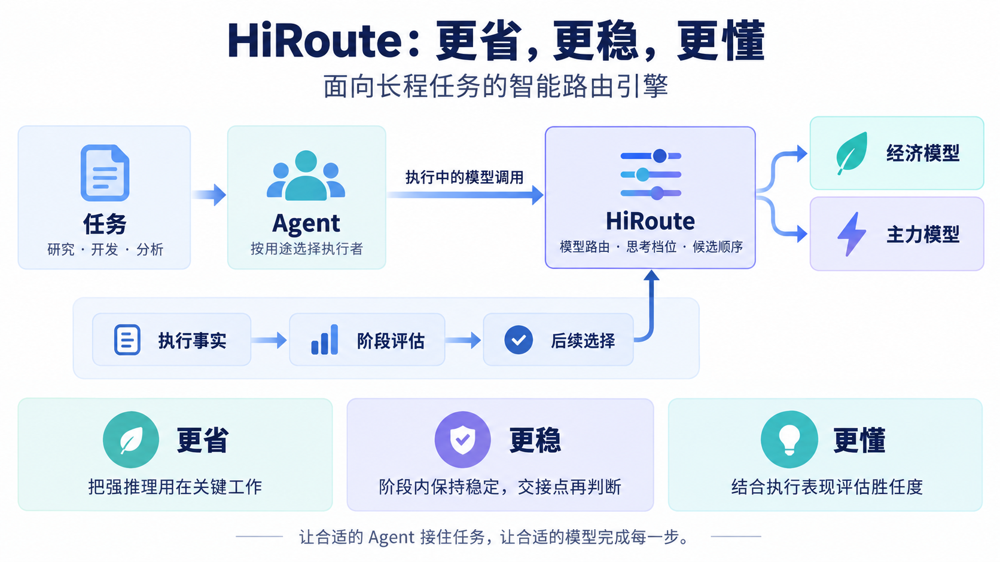
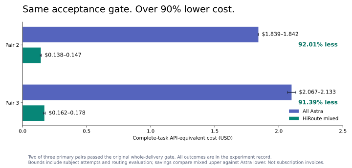
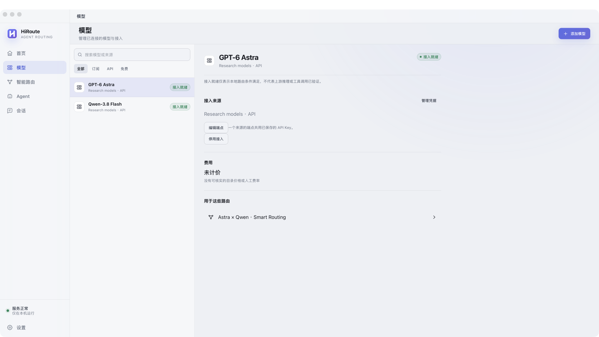
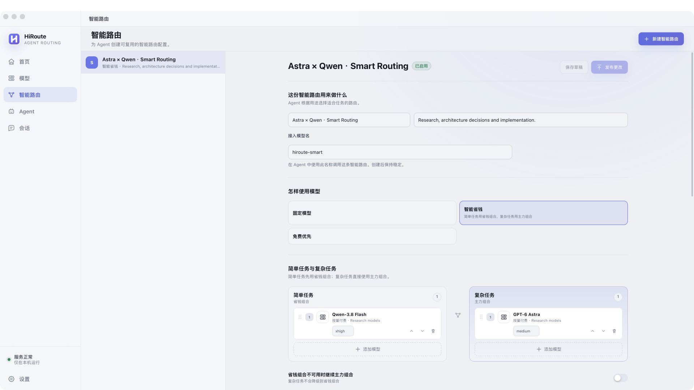
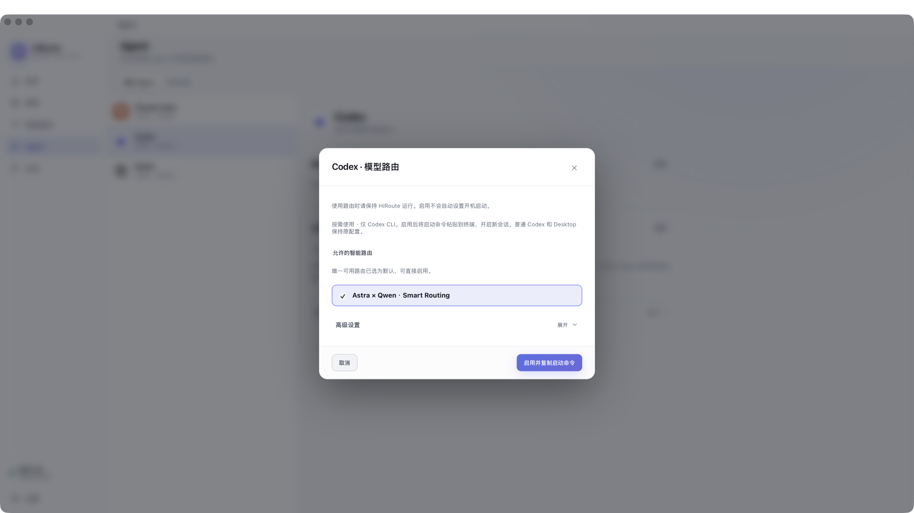
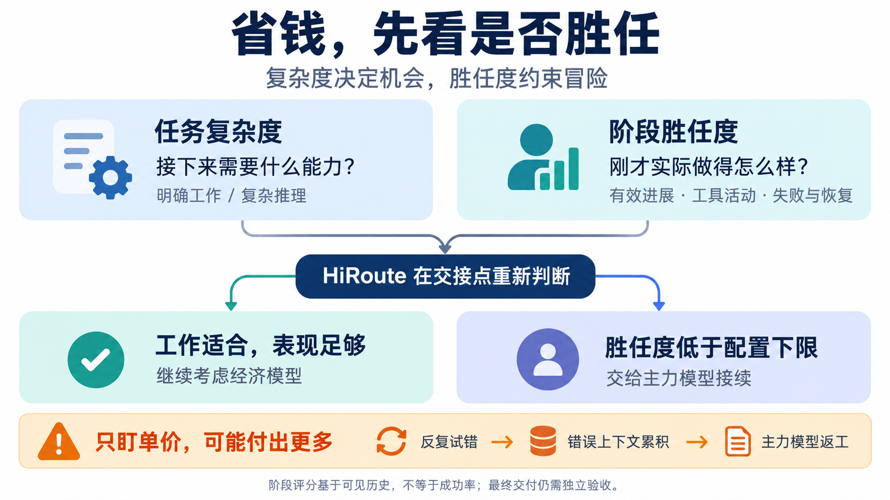
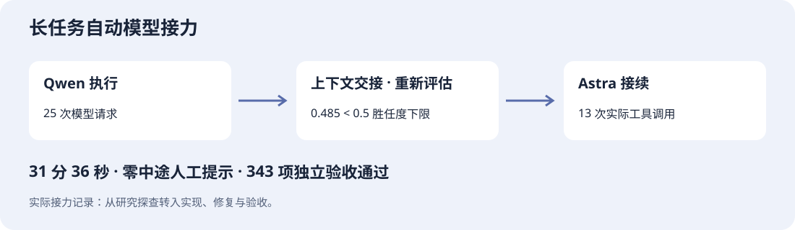
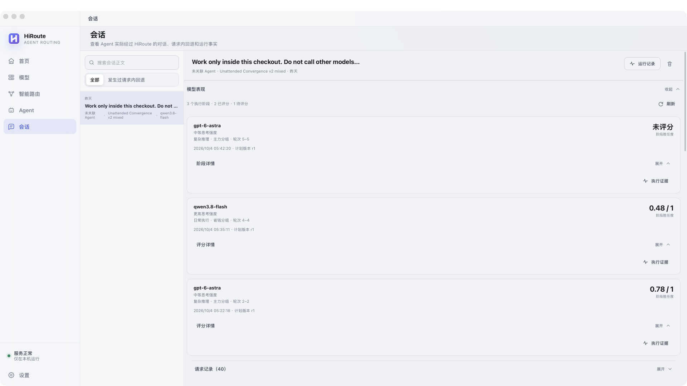
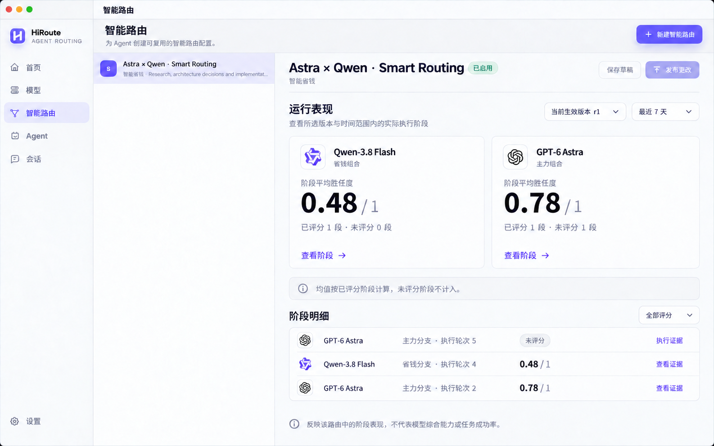
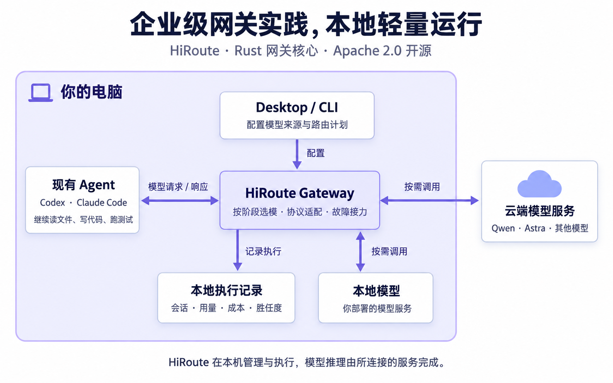

# HiRoute 智能路由实战：GPT-6 Astra × Qwen-3.8 Flash，同等质量下成本降低 90%

**让强模型处理关键判断，让经济模型承担大量常规工作，能省下多少？**

我们把 GPT-6 Astra 和 Qwen-3.8 Flash 接到同一份 HiRoute 路由计划里，完成了一次从技术调研到架构决策的工程任务。在达到相同整单验收标准的两次运行中，混合模式相较全 Astra 的成本分别降低 **92.01% 和 91.39%**。

另一项持续约 32 分钟的代码任务，则展示了智能路由的另一面：当经济模型迟迟没有把研究转成实现，HiRoute 在上下文交接时自动升级模型，随后完成开发，通过 **343 项独立验收**。整个过程没有人追加提示或手动切模型。

这两件事指向同一个问题：**长任务需要的不是始终使用同一个模型，而是在合适的阶段用上合适的能力。**

## HiRoute：让长程任务用上合适的模型

HiRoute 是一个运行在本机的开源智能路由引擎，面向持续执行的长程任务。它连接你已有的 Agent 与模型服务：你继续在 Codex、Claude Code、Qoder、DeepSeek Harness、Pi 等 Coding Agent 里提需求，Agent 继续读文件、写代码、跑测试；HiRoute 负责决定每段工作实际交给哪个模型。

HiRoute 还提供 **智能任务路由**：主 Agent 可以根据子任务的目标，从已发布的路由计划中选择合适的执行 Agent，委派调研、实现或测试等独立工作，再取回结果继续推进整体任务。任务路由负责“谁来做”，模型路由负责“每个阶段用哪个模型”；两者可以独立启用，也可以组合使用，让 Agent 分工与模型选择连成一套完整的智能路由方案。下面两项实战聚焦其中的模型路由。

在 Desktop 中接入模型、建立路由计划，再让 Agent 使用这份计划即可。Agent 看到的是稳定的接入模型名，背后的 Qwen、Astra 等模型则可以按任务需要调整。会话页面还能看到实际调用了谁、用了多少 token，以及此前阶段的执行表现。

这适合软件迭代的真实节奏：先调研、再设计，接着实现和测试，遇到复杂失败再深入排查。整理已有事实与推导新的系统保证，对模型能力的要求并不一样；解决完难点后，也未必需要继续为每一步支付最高单价。

## 实战一：强模型用在关键处，整单成本降低 90%

我们用一次消息系统方案评审，模拟常见的工程工作：先调研六种候选技术、核验官方资料，整理出可供比较的依据，再完成一份关键方案的决策备忘录。

最后的判断涉及一个很实际的问题：**系统中途出故障并重试时，怎样避免同一笔业务被重复处理或遗漏？** 资料里找到“支持事务”几个字还不够，模型必须判断这些能力组合起来，是否真的能满足业务要求。

这类任务的结构很常见：**大量资料整理，服务于少数关键判断。** 做技术选型，需要先对比功能，再判断方案是否适合自己的约束；做系统迁移，需要先盘点差异，再判断风险与回退方案；做兼容性评估，需要先核对接口，再识别会影响业务的冲突。每一步都需要认真完成，但并非每一步都需要最贵的模型。

我们让三种模式完成相同任务，使用相同资料和交付要求：

| 模式 | 实际分工 |
| --- | --- |
| 全 Astra | 调研与决策全部由 Astra 完成 |
| HiRoute 混合 | 六份资料整理由 Qwen 完成，关键决策备忘录由 Astra 完成 |
| 全 Qwen | 调研与决策全部由 Qwen 完成 |

HiRoute 按工作性质分配能力：整理与核验交给 Qwen，关键推理交给 Astra。强模型只承担需要它的那部分工作。

### 成本降下来，关键判断守住

在双方均通过原定整单验收的两次运行中，混合模式的资料核验平均正确率为 **99.03%**，全 Astra 为 **99.72%**，关键决策均通过。对应的整单成本降幅为 **91.39%–92.01%**。

更能体现能力差异的是三次关键决策审查：

| 模式 | 关键决策无重大错误 |
| --- | --- |
| HiRoute 混合 | **3/3** |
| 全 Astra | **3/3** |
| 全 Qwen | **1/3** |

Qwen 的资料整理并不差，差距主要出现在最后的判断：两次建议把某个局部环节的可靠性，误当成了整个方案的可靠性。这样的建议看起来完整，却可能让人选错方案。

混合模式把 Astra 用在了这个关键环节，而没有让它包办所有资料工作。**降本来自工作分配，质量来自关键判断有人胜任。** 这是这个案例最值得迁移到日常工程任务中的方法。

*成本比较取三次主实验中双方均达标的两次，按全部受试尝试与路由评估计算 API 等价成本；完整结果和验收口径见[实验记录](../experiments/cases/research-cost-quality/README.md)。这里的“同等质量”指达到相同交付标准。*

### 这份混合计划怎么配置

下面用 Desktop 展示模型接入、组合配置和 Agent 接入这三步。配置完成后，Agent 就能通过同一份计划使用 Qwen 与 Astra。

**1. 接入模型来源**

在“模型”页接入自己的模型服务，让 Qwen 与 Astra 出现在可选模型中。模型来源集中管理，后续可以复用到不同路由计划。

**2. 建立“智能省钱”计划**

进入“智能路由”，选择“智能省钱”，把 Qwen 放进“省钱组合”，Astra 放进“主力组合”。本次实战分别使用 `xhigh` 与 `medium` 思考档位。启用计划后，Agent 通过同一个接入模型名使用这组能力。

**3. 接到现有工作流，查看实际执行**

以 Codex 为例，在“Agent”页打开“模型路由”，勾选刚建立的计划，启用后复制启动命令，即可开启使用 HiRoute 的新会话。接下来按原来的方式下达任务；在“会话”页，还可以沿请求记录检查实际模型与用量。

## 实战二：三次自动接力，长任务无人干预完成

第二个实战把重点放在持续交付：在 HTTPX 中增加同步与异步 JSON 流式迭代，支持不同 JSON 流格式，处理编码和消费状态，并且在后续数据尚未到达时就能产出已经解析的值。我们只给原生 Codex 一次任务指令，让它持续执行。

### 在上下文交接时重新判断

模型单价低，不代表整单一定便宜。如果经济模型反复走错方向，强模型接手后还得重新理解上下文、排查错误、重做实现，返工就可能吃掉节省下来的成本。

所以 HiRoute 不仅判断“接下来这段任务难不难”，还会在重新选模的机会回看“刚才这段工作做得怎么样”。**任务复杂度决定何时可以省，阶段胜任度帮助判断是否还值得继续省。**

这种反馈在长任务中尤其重要。Agent 执行久了，会压缩上下文、带着摘要继续工作。HiRoute 能识别请求之间的上下文连续性，在这些**上下文交接点**重新评估模型选择；普通工具续轮则保持当前路由，避免每一步都来回换模。

于是，“让更强的模型接手”可以成为执行过程中的自动动作，不必等用户盯着会话、发现问题、追加指令。

### 三次接力，最终通过 343 项独立验收

这次采用经济模型优先起步的策略，阶段胜任度下限设为 **0.5**。实际执行走过 **Qwen → Astra → Qwen → Astra**，发生三次自动切换，全程没有人指定“现在换谁”。

1. **第一次升级，先完成上下文交接。** Qwen 阅读源码和测试后，此前阶段的胜任度为 **0.41**，低于保护线。HiRoute 选择 Astra 处理当时的上下文摘要请求，为后续执行准备交接内容。
2. **回到 Qwen，按阶段反馈继续分配工作。** 摘要阶段的评分回到保护线以上，按当时的经济优先策略，Qwen 获得继续执行的机会。期间还有一次重新评估，仍然保持 Qwen。
3. **再次升级，把研究推进到实现。** 后续工作仍停留在源码、测试与接口探查。第二次上下文交接时，阶段胜任度为 **0.485**，再次低于下限。HiRoute 升级到 Astra；Astra 随后写入 JSON 流式解析实现、运行测试，并继续修正异步迭代器关闭、编码边界和类型检查等问题，完成交付。

| 这次长任务 | 结果 |
| --- | --- |
| 从任务开始到结束 | **31 分 36 秒** |
| 自动模型切换 | **3 次：2 次升级，1 次回切** |
| 中途人工提示 / 人工代码补丁 | **0 / 0** |
| 关键升级后的 Astra 工具调用 | **13 次** |
| 结束后的独立验收 | **108 项功能 + 229 项回归 + 6 项增量性断言，全部通过** |

这次实战展示了执行反馈如何持续影响后续选模：从经济模型起步，在交接点重新评估，进展不足时升级，让更强模型接续实现和验证。用户可以把注意力放在最终交付上。[查看接力过程与验收记录](../experiments/cases/unattended-engineering/handoff-notes.md)

### 回到 HiRoute，看清每个阶段的表现

这些执行反馈也能在 HiRoute 中回看。会话的**模型表现**按执行阶段展示实际使用的模型、胜任度和评分覆盖范围。发现某一段进展不理想，可以沿“执行证据”和“评分触发反馈”定位相关过程；尚未产生评分的阶段也会保留展示。

路由计划的**运行表现**则提供更长时间范围的视角：选定计划版本和时间范围，查看各模型的阶段平均胜任度，以及已评分、未评分的阶段数。点击“查看阶段”可以继续核对具体执行，帮助判断怎样的模型组合更适合自己的任务。均值按已评分阶段计算，未评分阶段不计入。

## 企业级网关实践，轻量本地实现

HiRoute 将 [Higress AI Gateway](https://github.com/higress-group/higress) 积累的企业级 AI 网关能力与工程实践带到开发者本机，采用 **Rust** 构建轻量的本地 AI 网关核心。Desktop 与 CLI 共用同一套本地服务，统一管理模型接入、路由执行、故障接力与会话观测。

**HiRoute 的引擎、配置管理和观测记录在本地运行。** Agent 的模型请求先进入本机 Gateway，再按计划调用所连接的云端或本地模型服务；模型推理由这些服务完成。你可以继续使用已有 Agent，无需额外部署 HiRoute 云端中转服务。

HiRoute 项目代码以 [Apache 2.0 协议](https://github.com/higress-group/HiRoute/blob/main/LICENSE)完全开源，开发者可以自行构建、审查和扩展。可视化 Desktop 与无界面 CLI 使用同一套核心，既方便个人使用，也适合接入自动化工作流。

## 从你自己的 Agent 开始

两项实战的任务、评测结果与复现方法已在 [HiRoute 项目仓库](../experiments/README.md)开源。

想在自己的 Agent 上试试？**[去官网下载 HiRoute](https://hiroute.ai/download/)**。macOS 安装包**不到 100 MB**；安装后接入已有模型服务、选好路由计划，就能继续用熟悉的 Agent 开始工作。
