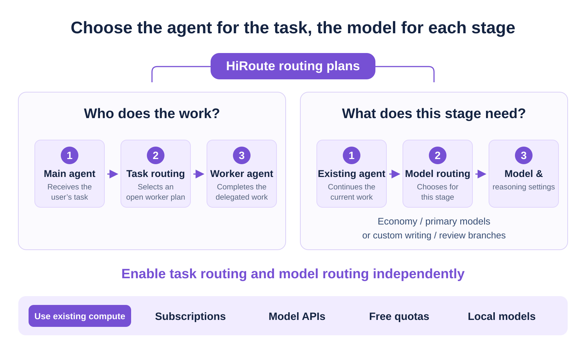
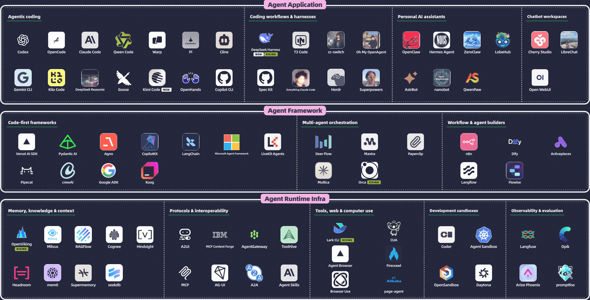
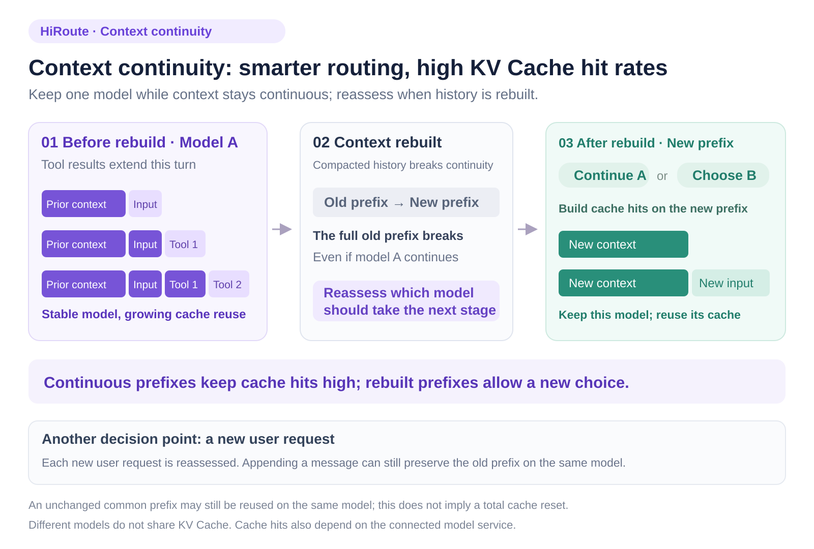
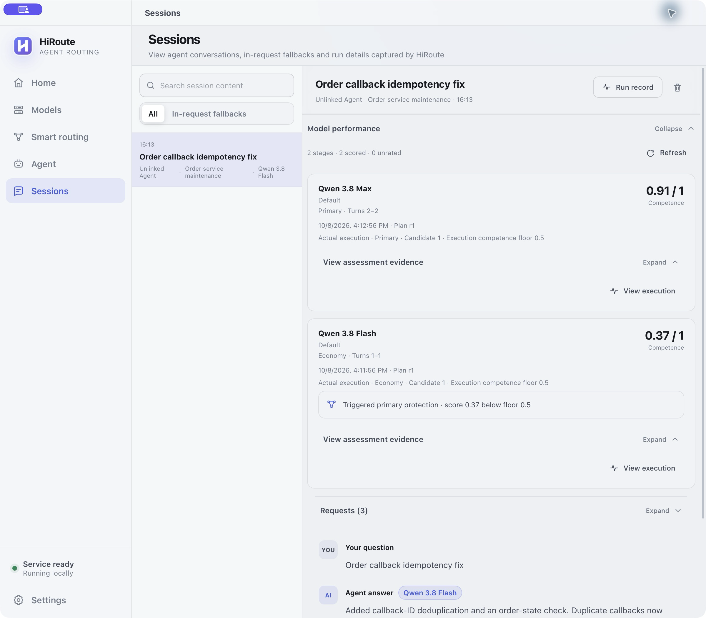
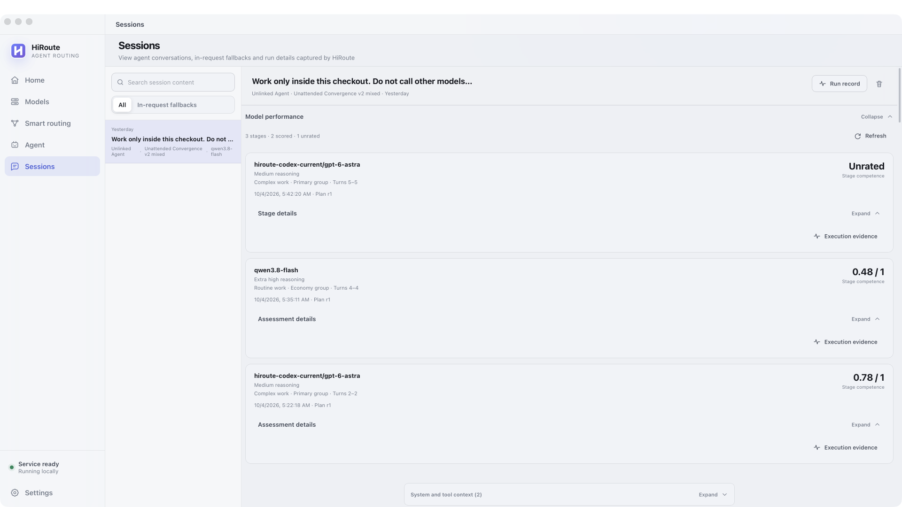
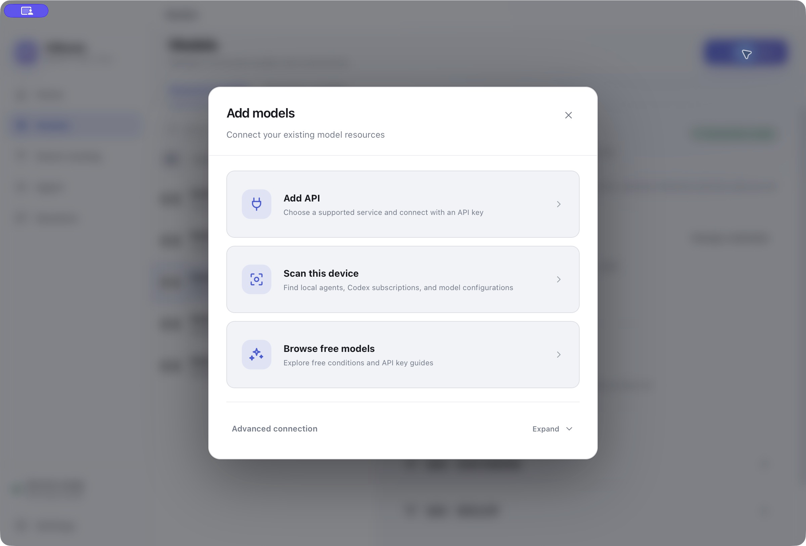
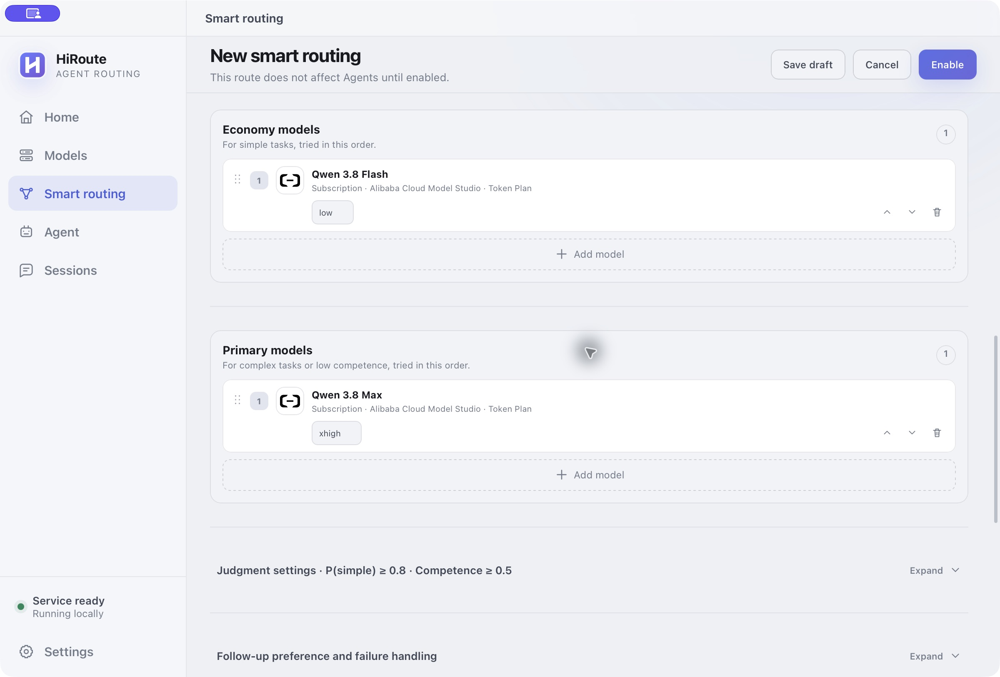
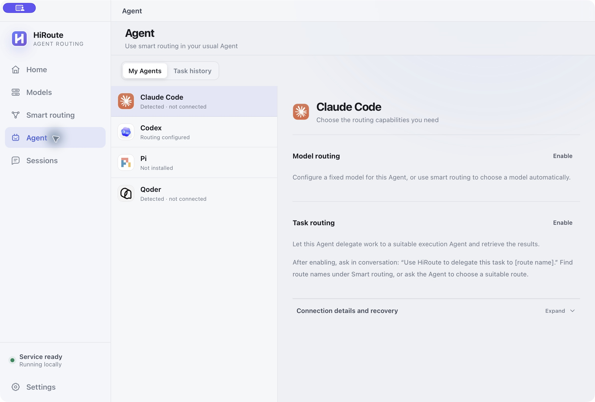
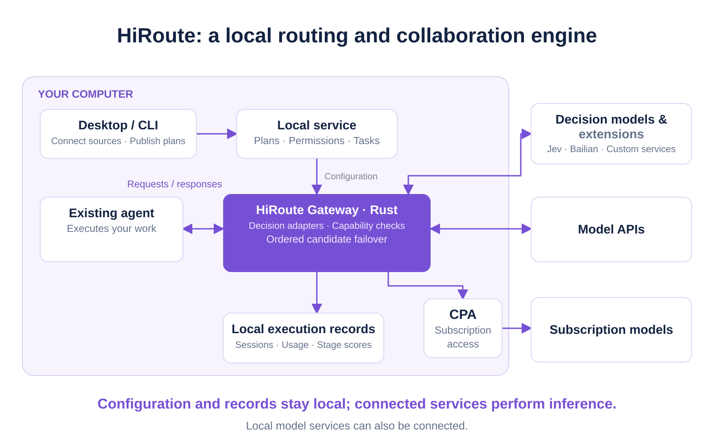

# HiRoute Is Open Source: Help Your Agents Do More and Your Subscriptions Go Further

An agent task can move from research and code reading to design and debugging. Each step calls for different model capabilities. Use your strongest model throughout, and routine work consumes valuable subscription capacity. Switch to an economy model, and you risk getting stuck on a critical decision or a difficult bug. With several agents, subscriptions, and providers' APIs available, working out how to combine them becomes another task in itself.

The Higress team built HiRoute to make that combination easier. **HiRoute is a local engine for intelligent agent routing and collaboration.** Keep using the agent you know, let economy models handle routine work, and bring in a primary model for demanding stages. When a task benefits from a separate worker, delegate it to another agent. The aim is to make your existing tools and compute work together, while reducing unnecessary spending and manual handoffs.

We previewed HiRoute's open-source plans in the keynote at AGNTCon + MCPCon China and formally open sourced it at the Apsara Conference. You can now download it, use it, and help build it.

*Figure 1. Task routing and model routing can be enabled independently or used together.*

## 1. Why open source: connect scattered agents, models, and compute

HiRoute grew out of three kinds of fragmentation we encounter every day.

Models have different strengths. Summarizing research, reasoning through a difficult problem, writing code, and handling long context all make different demands on capability and cost.

Agents have different workflows. Some people prefer Codex's execution flow, others know Claude Code best, and many use additional tools for research or specialized engineering work.

Compute is spread across subscriptions, API keys from different providers, and local services. Capabilities you have already paid for or configured can be difficult to use together.

*Figure 2. Agent applications, frameworks, and runtime infrastructure keep diversifying. Users need a simpler way to combine them.*

Long tasks add a time dimension to these choices. A job may start with research, move through design and implementation, and end with validation and difficult repairs. A model that works well for gathering information may not be enough for an architectural decision. Once the hard part is solved, the remaining steps may no longer need the most expensive capabilities.

Users therefore care about the cost of the whole task: whether the strongest model is used where it matters, whether subscription capacity is reserved for difficult work, whether failures allow a controlled handoff, and what evidence can inform the next choice.

HiRoute turns those choices into capabilities you can configure, reuse, and inspect. Open source lets developers review routing behavior, connect their own workflows, and improve the system through real tasks.

Configuration, routing, and observation run locally. Connected model services perform inference. Individual developers and teams building their own agents can start with tools they already use.

## 2. Product value: more capable agents, more useful subscriptions

### Combine models and subscriptions; reserve primary capacity for critical work

The most immediate benefit is keeping your strongest capabilities available for work that needs them.

If you have a supported subscription, such as Codex, alongside a lower-cost API, HiRoute can connect that subscription through CLIProxyAPI (CPA) and include both sources in one routing plan.

An economy API can handle research summaries and routine edits, while a primary model from your subscription handles complex analysis and critical repairs. That can reduce expensive calls and make subscription capacity go further. For example, place Qwen 3.8 Flash in the economy group and choose a stronger model suited to your tasks for the primary group.

### Connect decision models such as Jev; choose capabilities for the task

As agent work becomes longer, developers are taking an interest in System One models that specialize in fast decisions. [Jev](https://openrouter.ai/typesafe/jev-1.13/) is one example: its categories, probabilities, and scores are useful for deciding how work should proceed. **HiRoute includes Jev in its built-in decision-model system.**

Under **Models → Decision models**, connect a decision model from Bailian (Alibaba Cloud Model Studio) or TypeSafe's Jev through OpenRouter. You do not need to deploy your own decision service.

A decision model judges the current task's category and difficulty and can assess the preceding execution stage. HiRoute applies your thresholds, model groups, and candidate order to make the selection. Simple tasks use the economy group; complex tasks, or work following a stage that falls below your competence standard, use the primary group. You can edit the criteria and assessment prompts so that “simple,” “complex,” and “good enough” reflect your own work.

This also applies beyond coding. For an article, define separate **writing** and **review** branches. Writing can emphasize structure, expression, and use of source material; review can focus on evidence, factual accuracy, and omissions. Each branch can have regular and primary models. You define the categories and the standards.

A writing-stage score belongs to that actual execution stage. It is not automatically applied to a review task.

### Preserve context continuity; maintain high KV Cache hit rates

An agent usually completes work through repeated tool calls, responses, and further reasoning. Context grows throughout that process. High KV Cache hit rates help reduce input costs and response latency.

HiRoute uses **context continuity**, implemented by ContextHold, to recognize calls whose history continues within the same user turn. It retains the routing decision and prefers the eligible current model, allowing the growing context prefix to keep benefiting from cache reuse.

When context compaction or history rebuilding breaks the old complete prefix and the previous decision can no longer be continued, HiRoute reassesses the model at that boundary. Whether it keeps the same model or chooses another, execution then continues along the new prefix and builds cache hits again.

A new user request also triggers a fresh decision. Simply appending a message does not necessarily invalidate the previous prefix: continuing with the same model can still reuse existing cache.

*Figure 3. Keep the model stable while context is continuous. When the old complete prefix breaks, reassess the model and continue reusing KV Cache along the new prefix.*

### Give agents distinct roles; keep your familiar workflow

Choose agents around the work as well. Keep your usual main agent, delegate independent research, implementation, or test tasks to configured workers, then bring their results together. Task routing answers “who should do this?” Model routing answers “what capabilities does this stage need?” You can use either layer on its own or combine them.

### Record execution and handoffs; make model choices with evidence

When a candidate is rate limited or unavailable, HiRoute tries the next eligible candidate within the plan's boundaries. It stops explicitly when candidates are exhausted. Sessions and Model performance let you inspect which model actually ran each stage, why a selection occurred, how much it used, and whether the stage received an assessment. Your next routing plan can draw on your own execution records as well as general benchmarks.

*Figure 4. Model performance is organized by execution stage. Open a stage to inspect the assessment evidence and execution history.*

## 3. Proof in practice: lower costs and less manual intervention

### Lower costs: reserve strong reasoning for critical decisions, at over 90% lower cost

Our first case was a deliberately structured engineering research task: investigate six messaging systems, produce 60 source-verification cards for each, and deliver a decision memo on Kafka and SQL consistency.

The research required careful checking against official sources. The final memo asked harder questions: after failures and retries, could the design prevent duplicate business processing or missed operations? Finding that a component “supports transactions” was only the start; the agent had to decide whether that guarantee covered the whole business workflow. A large volume of research supported a few critical decisions—a familiar structure in technology selection and system migration.

We ran the same task in three modes: all GPT-6 Astra, HiRoute mixed routing, and all Qwen 3.8 Flash. In the mixed mode, Qwen handled the six research packages and Astra handled the critical decision memo.

In the two paired runs where both mixed routing and all Astra passed the original whole-task acceptance criteria, mixed routing reduced API-equivalent cost by **92.01% and 91.39%**, respectively.

Across those accepted runs, average source-verification accuracy was 99.03% for mixed routing and 99.72% for all Astra. Both passed the critical-decision review.

Three reviews of the critical memo show why the division matters: mixed routing and all Astra each passed 3/3 without major errors; all Qwen Flash passed 1/3. An economy model can do substantial research work, while the decisive reasoning still needs sufficient capability. Matching capabilities to the right stages makes it possible to maintain the delivery standard while spending less.

*Figure 5. The chart compares average costs across the two accepted paired runs; the percentages in the text describe each run separately. Costs include all attempts and routing assessments, using frozen API prices. They do not represent subscription-bill savings. The [full HiRoute case study](https://hiroute.ai/en/news/astra-qwen-smart-routing/) links to the process and experiment records.*

### Less intervention: automatic model handoffs complete a long task from one instruction

Our second case focused on sustained delivery. The task was to add synchronous and asynchronous streaming JSON iteration to HTTPX: support different stream formats, handle encoding and consumption state, and yield parsed values before later input arrived. We gave native Codex one instruction and let it work.

The economy-first plan went through four consecutive stages: **Qwen → Astra → Qwen → Astra**. Qwen first read source code and tests. The first Astra handoff prepared a context summary; the policy in use at the time then returned execution to Qwen.

Work continued, but remained largely focused on research and investigation. At the second context handoff, the recorded competence score was 0.485, below the 0.5 threshold, and HiRoute selected Astra again.

Astra then wrote the streaming parser, ran tests, and repaired asynchronous iterator cleanup, encoding edge cases, and type-checking issues.

The task took **31 minutes 36 seconds**, with no additional human prompts and no manual code patches during execution. Independent acceptance passed all **343 checks**: 108 functional checks, 229 regression checks, and 6 incremental-streaming assertions.

This makes the value of stage feedback concrete. An economy model starts the work; at a boundary where reassessment is possible, HiRoute checks progress and lets a primary model continue implementation and validation. The execution record also distinguishes summarizing, investigating, and actually writing code, so users can see what each handoff accomplished.

*Figure 6. One task crossed four model stages, with execution feedback guiding the later implementation and validation.*

*Figure 7. Native observation of the historical experiment. The first Astra stage produced only a summary; the final implementation stage remains unrated. Scores from different stages are not a controlled model ranking. This run retains its historical configuration and has no all-Astra cost baseline, so it supports a handoff result rather than a cost-reduction claim. The [handoff process and acceptance records](https://hiroute.ai/en/news/astra-qwen-smart-routing/) are public.*

## 4. Getting started: three steps into your existing workflow

HiRoute provides a macOS Desktop app and a headless CLI and background service for Linux. Configure it visually on a desktop, or use the same capabilities in servers and automated workflows.

For your first setup, start with a simple **Smart saving** plan.

### Step 1: connect models and subscriptions

In **Models**, add an API, a supported subscription, or a local model service. For example, use Qwen 3.8 Flash as the economy model and Qwen 3.8 Max as the primary model. You can also combine an economy API with an existing Codex subscription. Model sources are managed together; once connected, a source can be used in multiple plans.

*Figure 8. Start with Add models: connect an API, scan existing subscriptions and configurations, or browse free models.*

### Step 2: create and publish a routing plan

In **Smart routing**, choose **Smart saving**, add economy and primary models, and select a decision model. Built-in connections such as Bailian and Jev through OpenRouter need connection settings, without a separately deployed extension service. Judgment thresholds and assessment criteria are collapsed by default. Begin with the two model groups, then expand the settings when you need finer control. Once enabled, the published plan becomes a reusable model entry point.

*Figure 9. Choose economy and primary models for the combination. Expand judgment thresholds and advanced settings when needed.*

### Step 3: connect an agent and inspect execution

In **Agent**, enable **Model routing** and select your published plan for the agent you use. With Codex, copy the launch command after enabling routing, start a new session in your terminal, and give it tasks as usual. **Sessions** shows the actual models, usage, and costs. **Model performance** links competence scores to specific stages and execution evidence, giving you a basis for refining the next combination.

*Figure 10. Enable Model routing on the Agent page to connect your usual agent to a published plan.*

## 5. Architecture: local first, built on Higress engineering experience

HiRoute follows a **local-first architecture**. Configuration, routing, and observation records run on your machine, without a HiRoute cloud relay. Your agent's model requests reach the local gateway first, then the model services you choose.

When you use a cloud execution or decision model, the requests required for inference or assessment go to that service. You can also connect local models and use your own compute.

HiRoute Gateway is built in **Rust**. It brings engineering experience from [Higress AI Gateway](https://github.com/higress-group/higress) into local agent workflows: protocol adaptation, capability and eligibility checks, bounded candidate failover, streaming delivery, and execution observation. The Desktop app uses Tauri; Desktop and CLI share the same core, so visual setup and automated calls follow the same execution rules.

*Figure 11. Configuration, routing, and execution records stay on your machine. Connected services handle model inference and decisions; local model services can also be used.*

Those engineering capabilities serve four product principles.

### Separate task and model routing; reuse the plan

Task routing chooses the agent that carries out the work; model routing chooses the capabilities used at each stage. A plan expresses model groups, candidate order, task conditions, and assessment criteria, and publication saves a definite configuration snapshot. Editing a draft does not silently change a published plan or rewrite historical records. An effective combination can be reused for later work.

### Separate judgment and execution; respect the plan's boundaries

A decision model identifies the current task category and difficulty and assesses the preceding stage when evidence is sufficient. HiRoute applies your thresholds to select a group, checks that candidates satisfy the request, calls them in order, and uses bounded failover for availability failures. It fails explicitly when candidates are exhausted. A decision cannot bypass the execution boundaries of the published plan.

### Keep continuous execution stable; reassess each new turn

ContextHold recognizes history continuation within the same turn. When authorization, the plan, and candidates remain applicable, it retains the decision and prefers the current model. Every new user message triggers reassessment; so does a history rebuild that prevents reuse of the prior decision. One upgrade does not lock subsequent turns to the upgraded model.

### Bind scores to actual stages; make evidence traceable

A valid low score from the preceding stage can trigger primary-model protection. Without sufficient evidence, the stage remains explicitly unrated. Assessments belong to the actual task and model that ran, and users can inspect the underlying execution. The next turn still receives a fresh decision.

Developers who need their own decision algorithm can connect a service through the open **HTTP decision-extension protocol**. The extension integrates its chosen decision service and implements judgment and assessment; HiRoute retains threshold policy and execution control. The project provides an [OpenAPI contract and a deployable Jev reference implementation](https://hiroute.ai/en/docs/decision-api/) to bring domain-specific expertise into the same routing flow.

## 6. What's next: enterprise governance and a broader ecosystem

HiRoute already supports **five agent integrations: Codex, Claude Code, Qoder, Pi, and DeepSeek Harness**. Its built-in catalog covers **100+ providers and 700+ model configurations**, including the GPT, Claude, Qwen, DeepSeek, Kimi, and GLM families.

It also offers **seven models with free-quota access**, which can be combined with subscriptions, APIs, and local models.

We plan to develop HiRoute along two paths.

The first is **connecting enterprise AI infrastructure**. Integration with enterprise AI gateways such as Higress can let teams centralize authorization and credentials, publish shared routing plans, and track costs. Employees continue working through their familiar local agents, while model combinations proven by the team become available to more colleagues.

The second is **broadening the open ecosystem**. We will keep connecting more agents, models, subscriptions, and decision services, with OpenCode, Hermes, and OpenClaw among the directions ahead. Developers should be able to adapt combinations as tasks and models change, while community-contributed algorithms and integrations share a common runtime.

HiRoute is open source under **Apache 2.0**. Start with your first routing plan, make better use of the agents, models, and subscriptions you already have, and join us with a real workflow to improve.

[**Visit GitHub**](https://github.com/higress-group/HiRoute) · [**Download HiRoute**](https://hiroute.ai/en/download/) · [**Read the documentation**](https://hiroute.ai/en/docs/)
