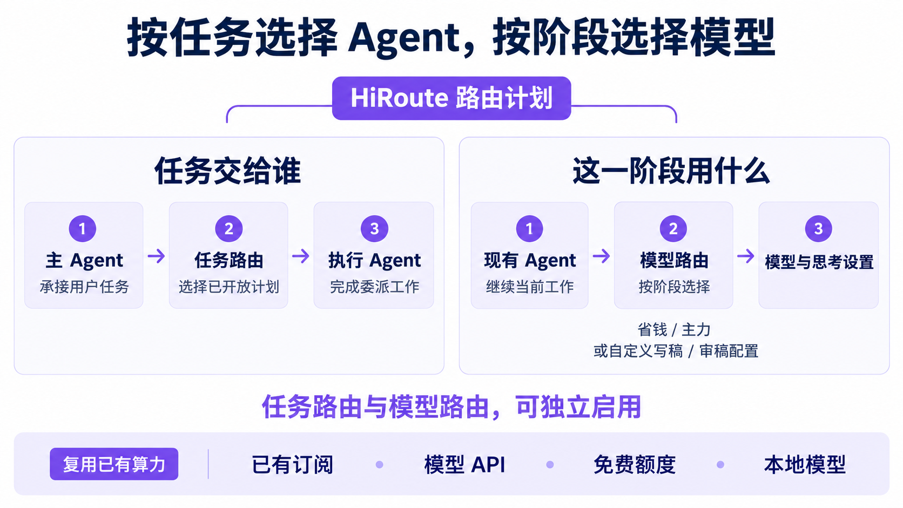
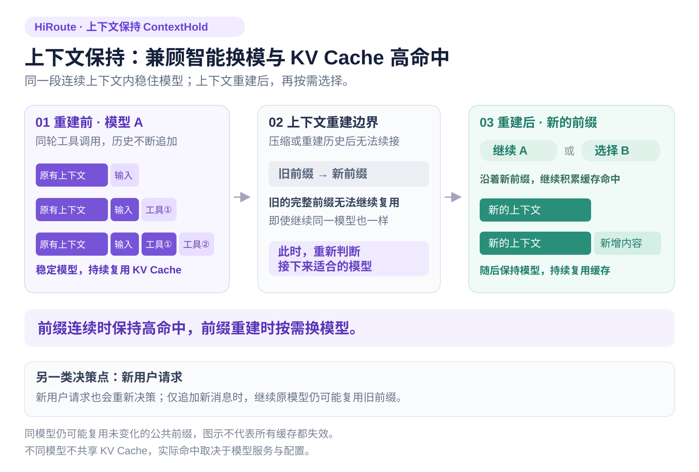
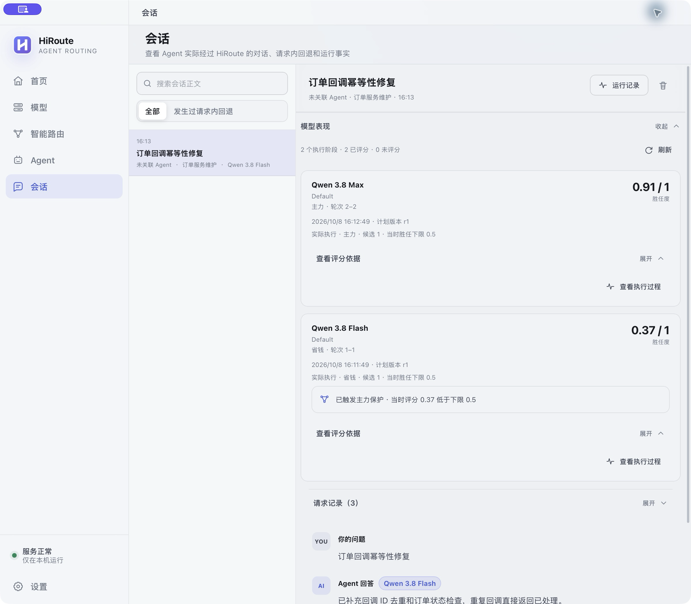
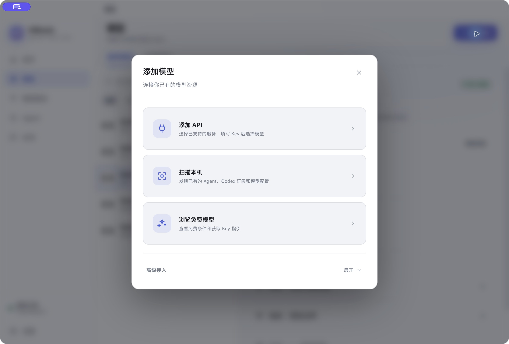
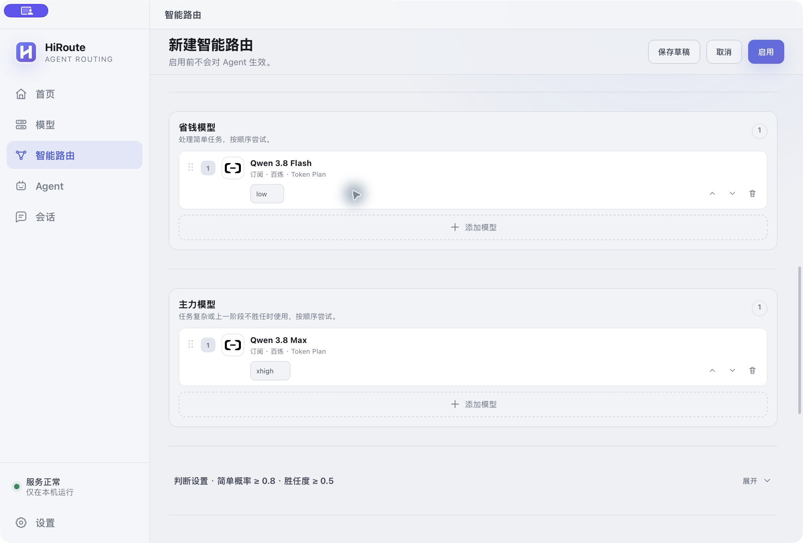
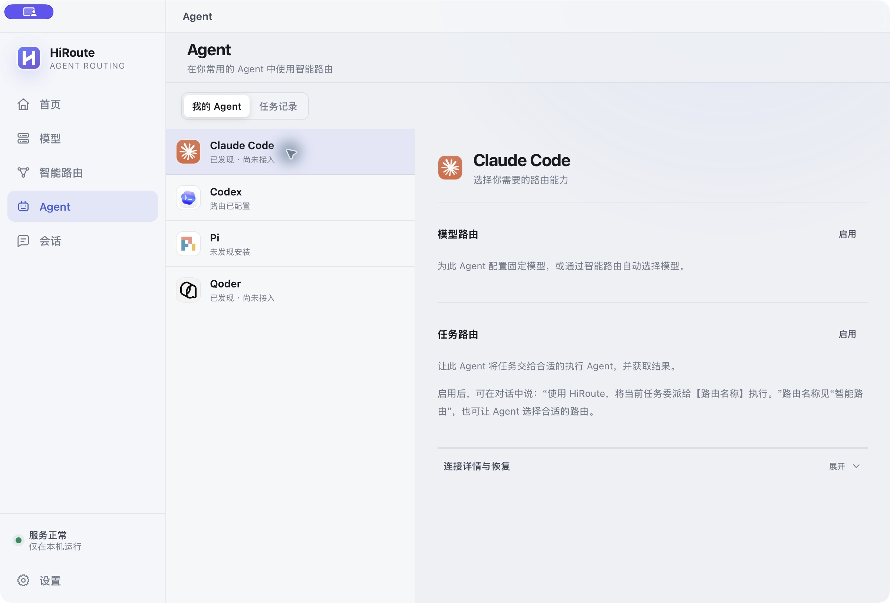
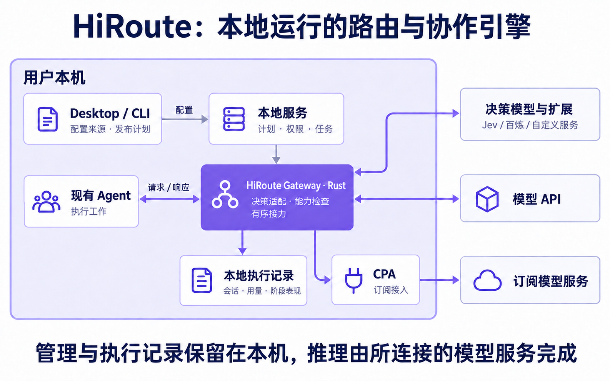

# 让 AI Agent 更能干，让模型订阅更耐用：HiRoute 正式开源

一项 Agent 任务，从查资料、读代码，到做设计、修问题，每一步对模型能力的要求并不一样。一直用主力模型，常规工作也在消耗宝贵的订阅额度；换成经济模型，又担心卡在关键判断和疑难问题上。手里有多个 Agent、几份订阅和不同厂商的 API，如何组合使用，也成了一项额外工作。

为此，Higress 团队打造了 HiRoute：一个运行在本地的 Agent 智能路由与协作引擎。继续使用你熟悉的 Agent，让经济模型承担常规工作，让主力模型处理关键阶段；需要分工时，还可以把独立任务交给其他 Agent。我们希望让你已有的工具与算力配合起来，在把工作做好的同时，减少不必要的开销和手动接力。

HiRoute 此前在 AGNTCon + MCPCon China 的 Keynote 演讲中预告开源，并在云栖大会正式开源。现在，你可以下载使用，也可以参与共建。

*图 1　任务路由与模型路由可以独立启用，也可以组合使用。*

## 一、为何开源：连接分散的 Agent、模型与算力

做 HiRoute，源于我们每天都在面对的三种碎片化。

模型各有所长：资料归纳、复杂推理、编码、长上下文处理，对能力和成本的要求不同。

Agent 也各有工作方式：有人习惯 Codex 的执行流程，有人更熟悉 Claude Code，也会为研究或特定工程任务使用其他工具。

算力则分散在订阅、不同厂商的 API Key 和本地服务中。已经购买、已经配置好的能力，往往很难组合起来使用。

*图 2　Agent 应用、框架与运行基础设施持续分化，用户需要更简单的组合方式。*

长程任务又为这些选择加上了时间维度。一项工作可能从调研开始，经过设计、实现、验证，最后进入疑难修复。整理资料时合适的模型，到了架构判断时未必足够；难点解决以后，后续步骤也未必还需要持续消耗最昂贵的能力。

用户开始关心整项任务的代价：主力模型是否用在关键处，订阅额度能否留给难题，失败时能否按规则接续，以及下次选模型时有什么事实可参考。

HiRoute 希望把这些选择变成可以配置、复用和检查的日常能力。我们选择开源，也希望开发者能够审查路由行为、接入自己的工作流，并用真实任务检验和改进这套机制。

配置、执行与观测在本地运行，模型推理由所连接的服务完成；个人开发者和自建 Agent 的团队，都可以从已有工具开始。

## 二、产品价值：让 Agent 更能干，让订阅更耐用

### 统筹模型与订阅，把主力能力留给关键工作

最直接的价值，是把主力能力留给真正需要它的工作。

如果你已经购买 Codex 等受支持的订阅，又配置了价格更低的 API，HiRoute 可以通过 CLIProxyAPI（CPA）接入受支持的订阅，把这些来源放进同一份路由计划。

让经济 API 承担资料整理、常规修改，把订阅中的主力模型用于复杂分析与关键修复，就有机会减少高价调用，也让订阅额度用得更久。比如将 Qwen3.8 Flash 放进省钱组，主力组则选择适合自己任务的强模型。

### 接入 Jev 等决策模型，按任务选择合适能力

随着 Agent 工作越来越长，专门承担快速判断的 System One 模型开始进入开发者视野。[Jev](https://openrouter.ai/typesafe/jev-1.13/) 就是其中一个代表：它擅长输出类别、概率与评分，适合用来判断下一步该如何执行。**HiRoute 已将 Jev 纳入内置决策模型体系。**

在“模型 → 决策模型”中，可以连接百炼或 TypeSafe 提供的 Jev 等决策模型，无需自行部署决策服务。

决策模型判断当前任务的类别和程度，并可评价上一实际执行阶段；HiRoute 根据你设定的阈值、模型组和候选顺序执行选择。任务简单时使用省钱组，任务复杂或上一阶段未达到胜任标准时使用主力组。你可以修改判断条件和评分提示词，让“简单”“复杂”“做得好”符合自己的业务。

这也适用于编码之外的工作。写一篇文章，可以给“写稿”和“审稿”配置不同分支：写稿侧重结构、表达和素材组织，审稿侧重论证、事实与遗漏；再为每类任务设置常规与主力模型。类别由你定义，标准由你掌握。

一次写稿阶段的评分归属于那次实际执行，不会被随意套用到审稿任务上。

### 保持上下文连续，兼顾 KV Cache 高命中

Agent 完成一项工作，往往需要反复调用工具、读取结果、继续推理，前面的上下文会不断积累。保持 KV Cache 高命中，能够降低输入成本与响应等待。

HiRoute 通过“上下文保持”（ContextHold）识别同一轮中历史连续的调用，沿用已有路由决策，并尽量继续使用当前模型，让不断增长的上下文前缀持续复用缓存。

当上下文压缩或重建导致旧的完整前缀断裂、原有决策无法续用时，HiRoute 会在这一边界重新判断模型。此时，无论继续原模型还是选择新模型，后续都沿着新的上下文保持连续执行，持续积累缓存命中。

新用户请求也会触发重新决策。不过，仅追加新消息时，原有前缀未必失效；继续原模型仍可能复用已有缓存。

*图 3　连续上下文内保持模型稳定；旧完整前缀断裂后，重新选模，再沿新前缀持续复用 KV Cache。*

### 组织多个 Agent 分工，保留熟悉的工作方式

Agent 的选择同样可以围绕工作展开。你保留惯用的主 Agent，把研究、实现或测试等独立任务委派给已配置的 Worker，再继续整合结果。任务路由回答“交给谁做”，模型路由负责“这个阶段用什么能力”；两层能力可以分别使用，也可以组合起来。

### 记录执行与接力，让模型选择有据可查

遇到限流或候选不可用，HiRoute 会在计划允许的范围内有序接力；候选耗尽时明确停止。每段工作实际用了哪个模型、发生了怎样的选择、消耗多少用量，以及是否获得阶段评分，都能在会话和模型表现中核对。这样，调整下一份路由计划时，用户可以依据自己的执行记录，而不只依赖通用榜单。

*图 4　会话中的模型表现按执行阶段呈现，可继续查看评分依据和执行过程。*

## 三、实战验证：既省成本，也省心

### 省成本：把强模型用在关键处，达标运行成本降低 90% 以上

第一项实战是专门设计的工程调研任务：研究六种消息系统，每种完成 60 张资料核验卡，最后交付一份 Kafka 与 SQL 一致性决策备忘录。

前面的工作需要仔细查证官方资料，最后则要回答更难的问题：系统故障并重试时，方案能否避免业务重复处理或遗漏？发现某个组件“支持事务”，还需要进一步判断这项保证能否覆盖整个业务流程。大量资料整理，最终服务于少数关键判断，这也是技术选型和系统迁移中常见的工作结构。

我们让三种模式处理相同任务：固定使用 GPT-6 Astra、由 HiRoute 混合路由，以及固定使用 Qwen-3.8 Flash。混合模式中，六份资料整理由 Qwen 完成，关键决策备忘录交给 Astra。

结果显示，在双方均通过原定整单验收的两次配对运行中，混合模式相较全 Astra 的 API 等价成本分别降低 **92.01% 和 91.39%**。

在这两次达标运行中，混合模式和全 Astra 的资料核验平均正确率分别为 99.03% 和 99.72%，关键决策均通过验收。

三次关键决策审查更能说明分工的价值：混合模式与全 Astra 都是 3/3 无重大错误，全 Qwen Flash 为 1/3。经济模型能够承担大量资料工作，关键判断仍需要足够的推理能力。把能力分配到合适环节，才有机会同时守住交付标准和成本。

*图 5　成本图比较两次达标运行的平均成本；正文百分比是各次降幅。统计包含受试尝试与路由评估，按冻结价格折算 API 等价成本，不代表订阅账单节省比例。完整过程与实验记录入口见[HiRoute 官网实战详解](https://hiroute.ai/news/astra-qwen-smart-routing/)。*

### 省心：模型自动接力，一次指令完成长任务

第二项实战关注持续交付。任务要求在 HTTPX 中增加同步与异步 JSON 流式迭代，支持不同流格式、处理编码和消费状态，并在后续数据尚未到达时就产出已经解析的值。我们只向原生 Codex 下达一次任务，让它持续执行。

这次采用经济模型优先的计划，实际经过 **Qwen → Astra → Qwen → Astra** 四个连续阶段。Qwen 先阅读源码和测试；第一次切到 Astra 时，处理的是上下文摘要，随后按当时的策略回到 Qwen。

继续执行后，工作仍主要停留在研究和探查。第二次上下文交接时，记录的阶段胜任度为 0.485，低于 0.5 下限，HiRoute 再次选择 Astra。

这次接手之后，Astra 写入流式解析实现，运行测试，并继续修复异步迭代器关闭、编码边界与类型检查等问题。

整项任务耗时 31 分 36 秒，中途没有人工追加提示，也没有人工代码补丁。最终独立验收的 108 项功能、229 项回归与 6 项增量性断言，合计 **343 项全部通过**。

这项实战让阶段反馈的价值变得具体：经济模型先承担工作，在可以重新判断的交接点检查进展，让主力模型接续实现与验证。执行记录同时保留了摘要、研究和真正写入代码的区别，方便用户回看每次切换究竟带来了什么。

*图 6　一次任务经历四个模型阶段，在执行反馈后接续实现与验证。*

*图 7　历史实验的原生会话记录。首轮 Astra 只生成摘要；最终实现阶段尚未评分，不同阶段分数不构成模型排名。该任务保留当时配置，且没有全 Astra 成本对照，不作降本结论。[接力过程与验收记录](https://hiroute.ai/news/astra-qwen-smart-routing/)已公开。*

## 四、快速上手：三步接入熟悉的工作流

HiRoute 提供 macOS Desktop，以及面向 Linux 的无界面 CLI 和后台服务。你可以在桌面上完成配置，也可以把同一套能力接入服务器和自动化流程。

第一次使用，从一份简单的“智能省钱”计划开始即可。

### 第一步：接入模型与订阅

在“模型”页添加 API、受支持的订阅或本地模型服务。例如，用 Qwen3.8 Flash 作为省钱模型，Qwen3.8 Max 作为主力模型；也可以把经济型 API 与已有 Codex 订阅组合起来。模型来源统一管理，一次接入后可用于多份路由计划。

*图 8　从“添加模型”开始，接入 API、扫描已有订阅与配置，或浏览免费模型。*

### 第二步：创建并发布路由计划

在“智能路由”中选择“智能省钱”，分别加入省钱和主力模型，再选择决策模型。百炼、OpenRouter Jev 等内置接入只需配置连接，无需自行部署扩展服务。判断阈值、评分标准等进阶设置默认收起，先选好两组模型就能开始；需要精细控制时，再展开调整。发布后，这份计划就成为可以重复使用的模型入口。

*图 9　选择省钱与主力模型即可配置组合，判断阈值与进阶设置按需展开。*

### 第三步：连接 Agent，查看执行效果

在“Agent”页启用模型路由，为常用 Agent 选择刚发布的计划。以 Codex 为例，启用后复制启动命令，在终端开启新会话，再像往常一样下达任务。进入“会话”，可以看到真正执行的模型、用量和成本；进入“模型表现”，还可以沿具体阶段查看胜任评分与执行证据，为下一次调整组合提供依据。

*图 10　在 Agent 页启用模型路由，将常用 Agent 接到已发布的智能路由计划。*

## 五、架构设计：本地优先，复用 Higress 工程积累

HiRoute 采用**本地优先**的架构：配置管理、路由执行和观测记录都在本机运行，无需部署 HiRoute 云端中转服务。Agent 的模型请求先进入本地网关，再前往你选择的模型服务。

选择云端执行模型或决策模型时，完成推理或判断所需的请求会发送到相应服务；选择本地模型时，也可以复用自己的本地算力。

HiRoute Gateway 使用 Rust 构建，将 [Higress AI Gateway](https://github.com/higress-group/higress) 积累的网关工程经验用于本地 Agent 工作流：统一处理协议适配、模型能力与资格检查、有边界的候选接力、流式交付和执行观测。Desktop 基于 Tauri，CLI 与桌面端共享同一套核心，让可视化操作与自动化调用遵循一致的执行规则。

*图 11　配置、路由与执行记录保留在本机；模型推理和决策由所连接的服务完成，也可以接入本地模型。*

这些工程能力最终服务于四个产品原则。

### 任务与模型分层，路由计划可以复用

任务路由安排由哪个 Agent 承担工作，模型路由安排每个阶段使用什么能力。模型组、候选顺序、任务条件和评分标准都可以在计划中明确表达；发布时保存确定的配置快照。后续修改草稿不会悄悄改变已发布计划，也不会改写历史记录，让一次有效的组合能够复用到后续任务。

### 判断与执行分离，模型选择遵循边界

决策模型判断当前任务类别、处理难度，并在证据充分时评价上一阶段。HiRoute 根据你设定的阈值选择模型组，再检查候选是否满足请求要求、按顺序调用，并在可用性故障时进行有限接力。候选耗尽就明确失败，判断结果不会绕过已发布计划的执行边界。

### 连续执行保持稳定，新的轮次重新决策

ContextHold（上下文保持）识别同轮历史续接，在授权、计划和候选仍适用时，沿用已有决策并尽量保持当前模型。每条新用户消息都会触发重新判断；历史重建导致原有决策无法复用时，也会重新判断。一次模型升级不会永久锁住后续轮次。

### 评分绑定实际阶段，执行证据可以追溯

上一阶段的有效低分可以触发主力保护，缺少证据时明确保留未评分状态。评分绑定实际执行的任务与模型，可以回到具体过程核对；新一轮仍会重新决策，一次升级不会永久锁住后续选择。

需要自己的判断算法时，开发者还可以通过开放的 **HTTP 决策扩展协议**接入服务。扩展负责对接自己的决策服务并实现判断与评分，HiRoute 保留阈值策略与执行控制。项目提供 [OpenAPI 文档和可部署的 Jev 参考实现](https://hiroute.ai/docs/decision-api/)，方便把领域经验接入同一条路由流程。

## 六、未来演进：连接企业治理，拓展开放生态

HiRoute 已适配 **Codex、Claude Code、Qoder、Pi、DeepSeek Harness 五类 Agent**，内置模型目录覆盖 **100 多家服务商、700 多种模型配置**，包括 GPT、Claude、Qwen、DeepSeek、Kimi、GLM 等模型家族；

同时提供 **7 款免费额度模型接入**，可以与已有订阅、API 和本地模型组合使用。

接下来，HiRoute 将沿两条路线继续演进。

一条是**连接企业 AI 基础设施**。通过对接 Higress 等企业 AI Gateway，让团队集中管理授权与凭据、统一发布智能路由计划，并形成可追踪的成本治理。员工仍从自己熟悉的本地 Agent 发起工作，团队验证有效的模型组合则可以共享给更多成员。

另一条是**持续扩大开放生态**。继续接入更多 Agent、模型、订阅与决策服务，推进 OpenCode、Hermes、OpenClaw 等后续方向，让开发者能够随任务和模型能力的变化调整组合，也让社区贡献的决策算法与集成能力获得共同的运行基础。

HiRoute 以 **Apache 2.0 协议**开源。欢迎从自己的第一份路由计划开始，把已有 Agent、模型和订阅用得更好，也欢迎带着真实工作流参与共建。

[**访问 GitHub**](https://github.com/higress-group/HiRoute) · [**下载 HiRoute**](https://hiroute.ai/download/) · [**阅读使用文档**](https://hiroute.ai/docs/)
